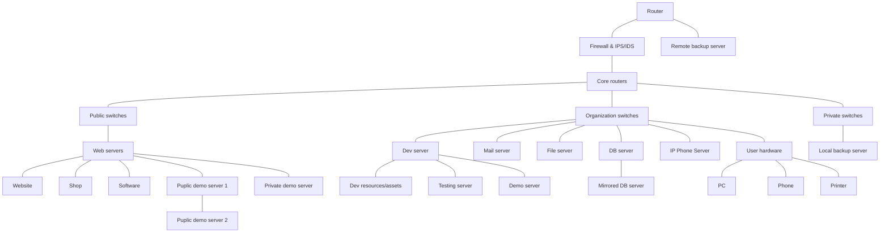

# Infrastructure

```mermaid
graph TD;
    ROUTER[Router]---FIREWALL[Firewall & IPS/IDS];
    ROUTER---REMOTE_BACKUP_SERVER[Remote backup server];
    FIREWALL---INTERNAL_ROUTER[Core routers];
    INTERNAL_ROUTER---SWITCH[Organization switches];
    INTERNAL_ROUTER---SWITCH_PUBLIC[Public switches];
    SWITCH_PUBLIC---WEB_SERVER[Web servers];
    WEB_SERVER---WEBSITE[Website];
    WEB_SERVER---SHOP[Shop];
    WEB_SERVER---SOFTWARE[Software];
    WEB_SERVER---DEMO_SERVER1[Puplic demo server 1];
    DEMO_SERVER1---DEMO_SERVER2[Puplic demo server 2];
    WEB_SERVER---DEMO_SERVER3[Private demo server];
    SWITCH---DEV_SERVER[Dev server];
    DEV_SERVER---DEV_RESOURCES[Dev resources/assets];
    DEV_SERVER---TESTING[Testing server];
    DEV_SERVER---INTERNAL_DEMO_SERVER[Demo server];
    SWITCH---MAIL_SERVER[Mail server];
    SWITCH---FILE_SERVER[File server];
    SWITCH---DB_SERVER[DB server];
    DB_SERVER---MIRRORED_DB_SERVER[Mirrored DB server];
    SWITCH---IP_PHONE_SERVER[IP Phone Server];
    SWITCH---USER_HARDWARE[User hardware];
    USER_HARDWARE---PC[PC];
    USER_HARDWARE---PHONE[Phone];
    USER_HARDWARE---PRINTER[Printer]
    INTERNAL_ROUTER---SWITCH_PRIVATE[Private switches];
    SWITCH_PRIVATE---LOCAL_BACKUP_SERVER[Local backup server];
```

2022-01-01 - Version 1.0

