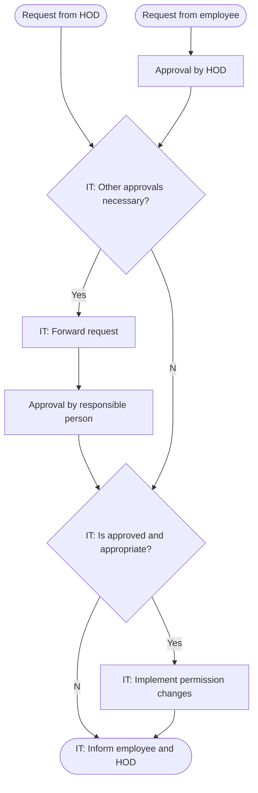

# Permission Change Management

Permission changes are sometimes necessary if a role of an employee changes or if the employee has to take over additional tasks. Such permission requests must get approved by the respective HOD and verified by the IT department. If the change request is justified the IT department changes the permissions for the employee.

Permissions should always be defined as low as possible and only get expanded if required. The IT department can decide to reject a permission change if they consider the request inappropriate.

## Flowchart

2022-01-01 - Version 1.0

