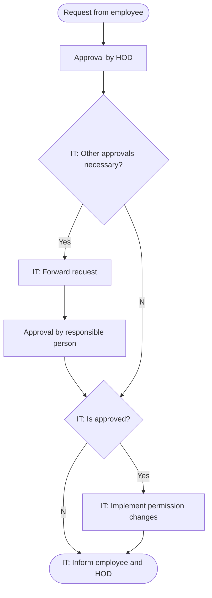

# Permission Change Management

```mermaid
graph TD;
  REQUEST([Request from employee])-->APPROVAL_HOD[Approval by HOD];
  APPROVAL_HOD-->IT_CHECKS{IT: Other approvals necessary?};
  IT_CHECKS--Yes-->FORWARD[IT: Forward request];
  FORWARD-->APPROVAL_RESPONSIBLE[Approval by responsible person];
  APPROVAL_RESPONSIBLE-->VALIDATE{IT: Is approved?};
  IT_CHECKS--No-->VALIDATE;
  VALIDATE--Yes-->IMPLEMENT[IT: Implement permission changes];
  VALIDATE--No-->INFORM([IT: Inform employee and HOD]);
  IMPLEMENT-->INFORM;
```

2022-01-01 - Version 1.0

