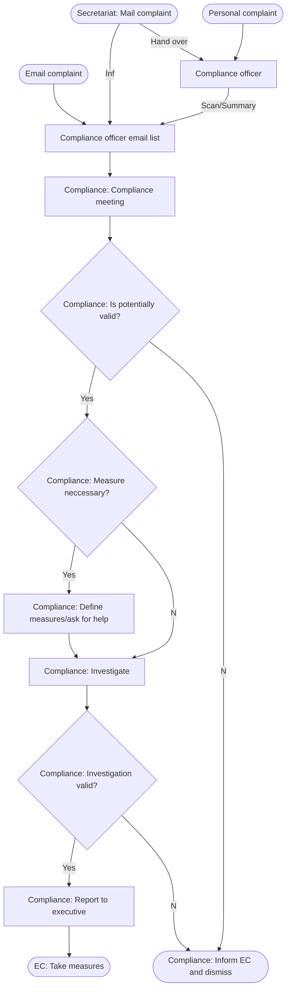

# Whistleblower System

The whistleblower System is a way to allow anyone to report illegal behavior or behavior which goes against the processes, policies and guidelines by any affiliated person or affiliated company to the organization. The complaint can be done anonymous or with the name of the reporter. Generally, it is recommended to provide your name when making a complaint which allows the persons in charge of the whistleblower system to contact the reporting person in case of additional questions. If the name is not provided investigations can become difficult to complete. 

## Contact system

Compliance complaints can arrive in the following three ways:

* Email: [compliance@karaka.app](compliance@karaka.app) (is automatically sent to all compliance officers)
* Letter in an enveloper addressed to: Compliance (handed over by the secretariat to any compliance officer. The secretariat sends a email to [compliance@karaka.app](compliance@karaka.app), that a compliance mail arrived and who received the letter)
* Direct contact to any compliance officer mentioned in the [Organigram](../Processes/Organigram.md).

## Information

All the information regarding a compliance complaint must be shared between all compliance officers unless a compliance officer is directly involved in the compliance complaint. In such a case the compliance officer must be excluded for this compliance complaint from the compliance activities. In such a case information should also be shared directly instead of using the compliance mailing list. In some cases a compliance complaint requires very quick measures, even if the investigation didn't start. The compliance officers need to carefully check the complaint and decide if any immediate measures are necessary. In such a case the measures must be communicated to the executive members including the reasoning. If the compliance officers have difficulties with making such a call they can ask executive committee members for help. Of course the executive committee member(s) who are asked for help must not be involved in the compliance complaint. 

## Complaint validation

Before any measures or investigations get started into a complain the compliance officers must check if the complaint could be invalid. In such a case the complaint can be immediately dismissed and the information regarding the complaint (what was the complaint, what is the status and what is the basis for the decision of the compliance officers) must be sent by the compliance officers to the executive committee members. If a complaint could be real it must be validated through an investigation which could be for example:

* interviewing the person who reported the complaint
* checking documents which could proof or disproof the contents of the complaint
* interviewing the person who is mentioned in the complaint
* interviewing related persons

The investigation should be conducted very carefully to avoid early opinion making without sufficient evidences. 

## Conclusion

The conclusion of the investigation must be reported to the executive committee who decide on further measures and steps which should be taken. The compliance complaint must be mentioned in the executive committee minutes.

## Compliance officers

Compliance officers are chosen based on the following characteristics by the executive committee:

* Trustworthy
* Incorruptible
* High intellect to evaluate and investigate complaints
* Compliance officers are in different departments
* Compliance officers have different positions
* 3-5 compliance officers must be active in the company

## Flowchart

2022-01-01 - Version 1.0
