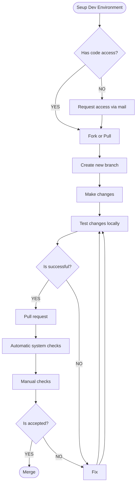

# Development Flowchart

```mermaid
graph TD;
    SETUP_DEV_ENV([Seup Dev Environment])-->HAS_ACCESS{Has code access?};
    HAS_ACCESS-- YES -->FORK[Fork or Pull];
    HAS_ACCESS-- NO -->REQUEST_ACCESS[Request access via mail];
    FORK-->NEW_BRANCH[Create new branch];
    REQUEST_ACCESS-->FORK;
    NEW_BRANCH-->CHANGE[Make changes];
    CHANGE-->TEST_CHANGE[Test changes locally];
    TEST_CHANGE-->IS_SUCCESSFUL{Is successful?};
    IS_SUCCESSFUL-- YES -->PULL_REQUEST[Pull request];
    IS_SUCCESSFUL-- NO -->FIX[Fix];
    FIX-->TEST_CHANGE;
    PULL_REQUEST-->AUTOMATIC_CHECKS[Automatic system checks]
    AUTOMATIC_CHECKS-->MANUAL_CHECKS[Manual checks]
    MANUAL_CHECKS-->IS_ACCEPTED{Is accepted?};
    IS_ACCEPTED-- YES -->MERGE([Merge]);
    IS_ACCEPTED-- NO -->FIX;
    FIX-->TEST_CHANGE;
```

2022-01-01 - Version 1.0
