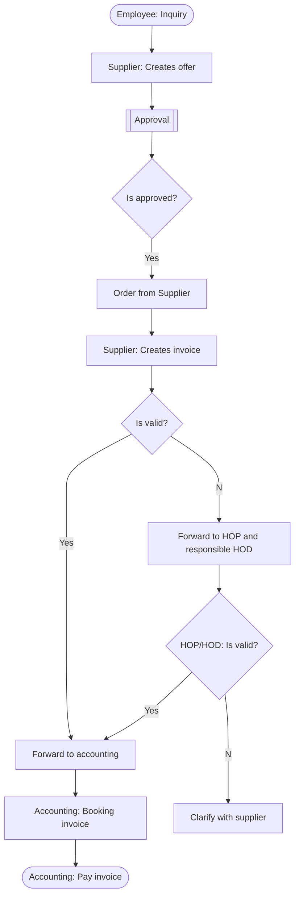
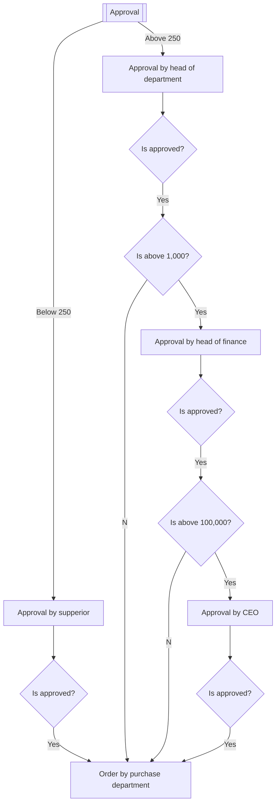

# Purchase Flowchart

```mermaid
graph TD;
    INQUIRY([Employee: Inquiry])-->OFFER[Supplier: Creates offer];
    OFFER-->APPROVAL[[Approval]];
    APPROVAL-->APPROVED{Is approved?};
    APPROVED-- Yes -->ORDER[Order from Supplier];
    ORDER-->INVOICE[Supplier: Creates invoice];
    INVOICE-->CHECK_INVOICE{Is valid?};
    CHECK_INVOICE--Yes-->FORWARD_TO_ACCOUNTING[Forward to accounting];
    CHECK_INVOICE--No-->FORWARD_TO_RESPONSIBLE[Forward to HOP and responsible HOD];
    FORWARD_TO_RESPONSIBLE-->CHECK_INVOICE_2{HOP/HOD: Is valid?};
    CHECK_INVOICE_2--Yes-->FORWARD_TO_ACCOUNTING;
    CHECK_INVOICE_2--No-->CLARIFY[Clarify with supplier];
    FORWARD_TO_ACCOUNTING-->BOOKING[Accounting: Booking invoice];
    BOOKING-->PAYING([Accounting: Pay invoice]);
```

## Approval Flowchart

```mermaid
graph TD;
    APPROVAL[[Approval]]--Below 250-->APPROVAL_BY_SUPERIOR[Approval by supperior]
    APPROVAL_BY_SUPERIOR-->STAGE_1{Is approved?}
    STAGE_1--Yes-->ORDER[Order by purchase department]
    APPROVAL--Above 250-->APPROVAL_BY_HEAD_OF[Approval by head of department]
    APPROVAL_BY_HEAD_OF-->STAGE_2{Is approved?}
    STAGE_2--Yes-->IS_ABOVE_2{Is above 1,000?}
    IS_ABOVE_2--Yes-->APPROVAL_BY_HEAD_OF_FINANCE[Approval by head of finance]
    IS_ABOVE_2--No-->ORDER
    APPROVAL_BY_HEAD_OF_FINANCE-->STAGE_3{Is approved?}
    STAGE_3--Yes-->IS_ABOVE_3{Is above 100,000?}
    IS_ABOVE_3--Yes-->APPROVAL_BY_CEO[Approval by CEO]
    IS_ABOVE_3--No-->ORDER
    APPROVAL_BY_CEO-->STAGE_4{Is approved?}
    STAGE_4--Yes-->ORDER
```

2022-01-01 - Version 1.0
