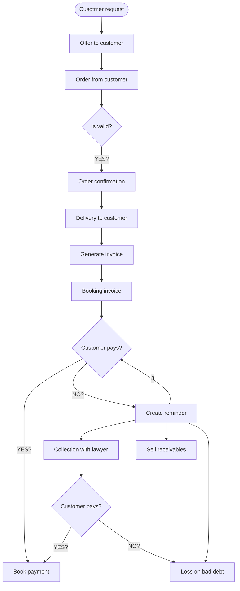

# Sales Flowchart

```mermaid
graph TD;
    REQUEST([Cusotmer request])-->OFFER[Offer to customer]
    OFFER-->ORDER[Order from customer];
    ORDER-->VALID_ORDER{Is valid?};
    VALID_ORDER--YES?-->ORDER_CONFIRMATION[Order confirmation];
    ORDER_CONFIRMATION-->DELIVERY[Delivery to customer];
    DELIVERY-->INVOICE[Generate invoice];
    INVOICE-->BOOKING[Booking invoice];
    BOOKING-->PAYMENT{Customer pays?};
    PAYMENT--YES?-->BOOKING_PAYMENT[Book payment];
    PAYMENT--NO?-->REMINDER[Create reminder];
    REMINDER--3-->PAYMENT;
    REMINDER-->LAWYER[Collection with lawyer];
    REMINDER-->SELL_RECEIVABLE[Sell receivables];
    REMINDER-->BAD_DEBT[Loss on bad debt];
    LAWYER-->LAWYER_PAID{Customer pays?};
    LAWYER_PAID--YES?-->BOOKING_PAYMENT;
    LAWYER_PAID--NO?-->BAD_DEBT;
    
```

2022-01-01 - Version 1.0
