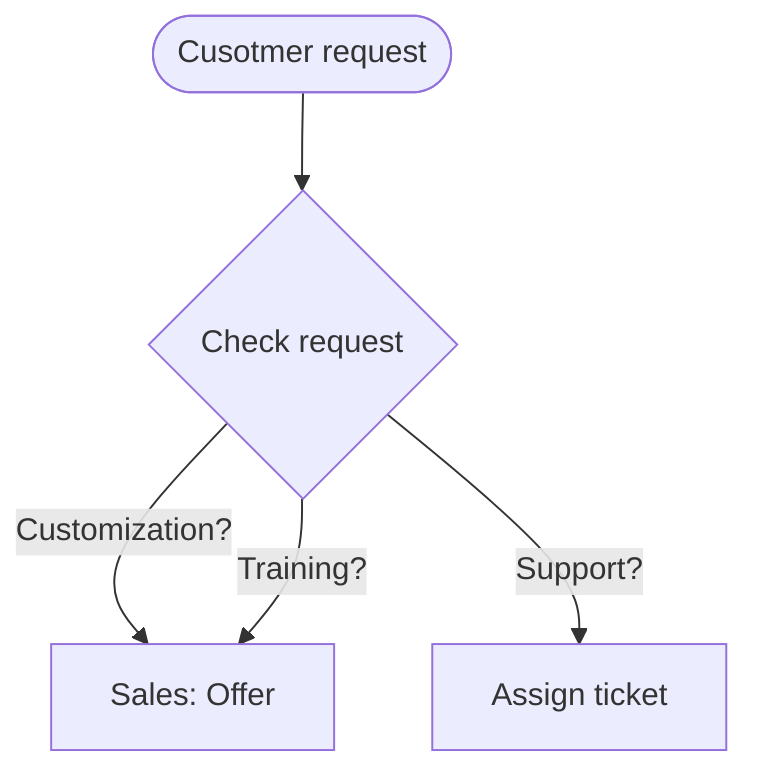

# Support & Service Flowchart

## Support ticket

```mermaid
graph TD;
    REQUEST([Cusotmer request])-->CHECK_REQUEST{Check request}
    CHECK_REQUEST--Customization?-->OFFER[Sales: Offer]
    CHECK_REQUEST--Training?-->OFFER[Sales: Offer]
    CHECK_REQUEST--Support?-->TICKET_ASSIGN[Assign ticket]
```

2022-01-01 - Version 1.0
