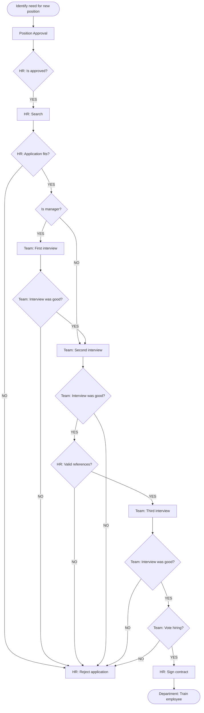

# HR Flowchart

## Hiring

```mermaid
graph TD;
    IDENTIFY([Identify need for new position])-->APPROVAL[Position Approval];
    APPROVAL-->APPROVAL_SEARCH{HR: Is approved?};
    APPROVAL_SEARCH--YES-->SEARCH[HR: Search];
    SEARCH-->CHECK_APPLICATION{HR: Application fits?};
    CHECK_APPLICATION--YES-->SKIP_FIRST{Is manager?};
    SKIP_FIRST--YES-->INTERVIEW_1[Team: First interview];
    SKIP_FIRST--NO-->INTERVIEW_2;
    CHECK_APPLICATION--NO-->REJECT[HR: Reject application];
    INTERVIEW_1-->CHECK_INTERVIEW_1{Team: Interview was good?};
    CHECK_INTERVIEW_1--YES-->INTERVIEW_2[Team: Second interview];
    CHECK_INTERVIEW_1--NO-->REJECT;
    INTERVIEW_2-->CHECK_INTERVIEW_2{Team: Interview was good?};
    CHECK_INTERVIEW_2--YES-->CHECK_REFERENCES{HR: Valid references?};
    CHECK_REFERENCES--YES-->INTERVIEW_3[Team: Third interview];
    CHECK_REFERENCES--NO-->REJECT;
    CHECK_INTERVIEW_2--NO-->REJECT;
    INTERVIEW_3-->CHECK_INTERVIEW_3{Team: Interview was good?};
    CHECK_INTERVIEW_3--NO-->REJECT;
    CHECK_INTERVIEW_3--YES-->VOTE{Team: Vote hiring?}
    VOTE--YES-->SIGN_CONTRACT[HR: Sign contract];
    VOTE--NO-->REJECT
    SIGN_CONTRACT-->TRAIN([Department: Train employee])
```

2022-01-01 - Version 1.0

