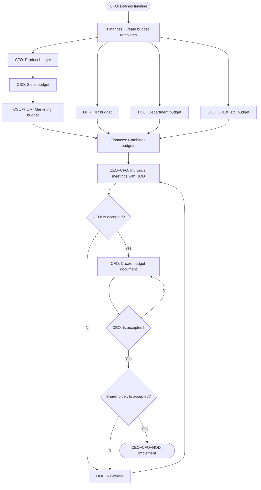
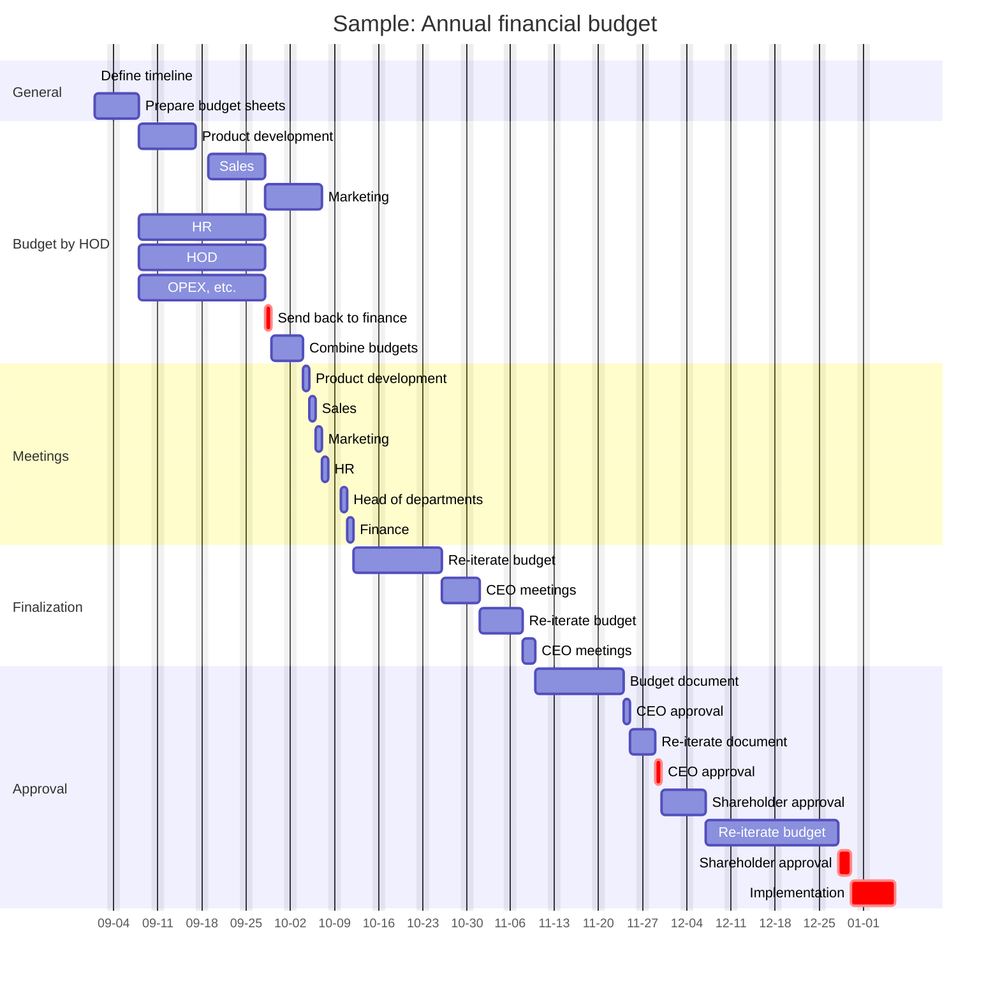
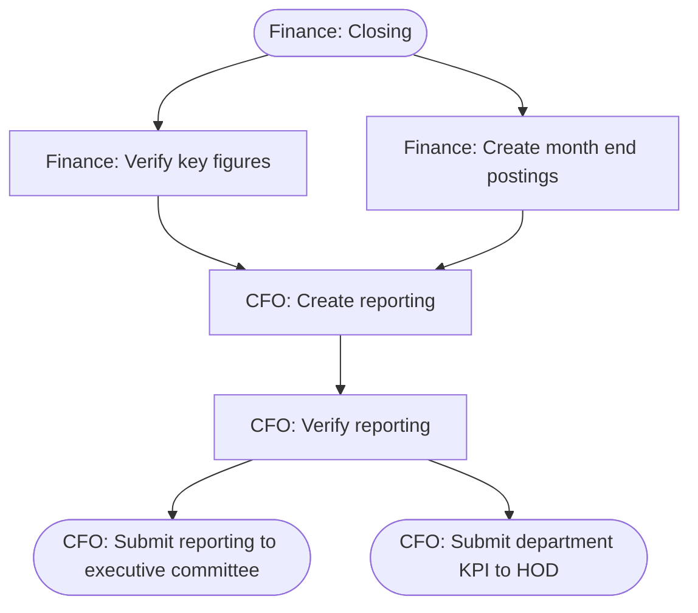
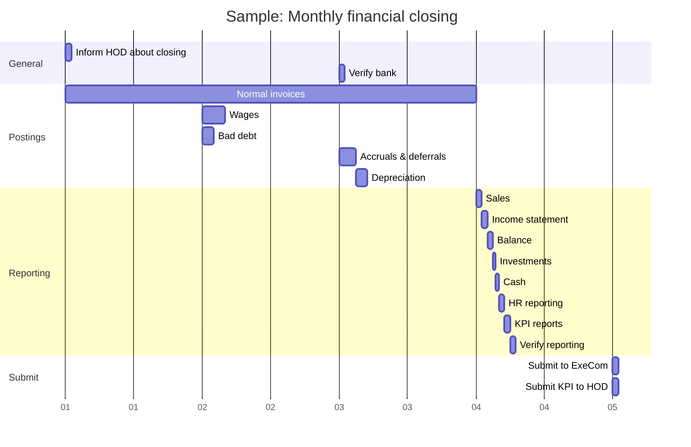

# Finance Flowchart

## Budget

```mermaid
graph TD;
    DEFINE_TIMELINE([CFO: Defines timeline])-->CREATE_BUDGET_TEMPLATES[Finances: Create budget templates];
    CREATE_BUDGET_TEMPLATES-->PRODUCT_TEMPLATE[CTO: Product budget]
    PRODUCT_TEMPLATE-->SALES_TEMPLATE[CSO: Sales budget];
    SALES_TEMPLATE-->MARKETING_TEMPLATE[CSO+HOM: Marketing budget];
    CREATE_BUDGET_TEMPLATES-->HR_TEMPLATE[DHR: HR budget];
    CREATE_BUDGET_TEMPLATES-->HOD_TEMPLATE[HOD: Department budget];
    CREATE_BUDGET_TEMPLATES-->FINANCE_TEMPLATE[CFO: OPEX, etc. budget];
    MARKETING_TEMPLATE-->COMBINE1[Finances: Combines budgets];
    HR_TEMPLATE-->COMBINE1;
    HOD_TEMPLATE-->COMBINE1;
    FINANCE_TEMPLATE-->COMBINE1;
    COMBINE1-->MEETINGS1[CEO+CFO: Individual meetings with HOD];
    MEETINGS1-->IS_GOOD1{CEO: Is accepted?};
    IS_GOOD1--No-->REITERATE[HOD: Re-iterate];
    REITERATE-->MEETINGS1;
    IS_GOOD1--Yes-->BUDGET_DOC[CFO: Create budget document];
    BUDGET_DOC-->IS_GOOD2{CEO: Is accepted?};
    IS_GOOD2--No-->BUDGET_DOC;
    IS_GOOD2--Yes-->IS_GOOD3{Shareholder: Is accepted?};
    IS_GOOD3--No-->REITERATE;
    IS_GOOD3--Yes-->IMPLEMENT([CEO+CFO+HOD: Implement]);
```

```mermaid
gantt
    dateFormat  YYYY-MM-DD
    title       Sample: Annual financial budget
    excludes    weekends
    axisFormat  %m-%d

    section General
    Define timeline           :            des1, 2022-09-01, 1h
    Prepare budget sheets     :         des2, 2022-09-01, 5d

    section Budget by HOD
    Product development       :         des3, after des2, 7d
    Sales                     :         des4, after des3, 7d
    Marketing                 :         des5, after des4, 7d
    HR                        :         des6, after des2, 14d
    HOD                       :         des7, after des2, 14d
    OPEX, etc.                :         des8, after des2, 14d
    Send back to finance      :crit,    des9, after des8, 1d
    Combine budgets              :            des10, after des9, 3d

    section Meetings
    Product development          :            des11, after des10, 1d
    Sales                     :         des12, after des11, 1d
    Marketing                 :         des13, after des12, 1d
    HR                        :         des14, after des13, 1d
    Head of departments       :         des15, after des14, 1d
    Finance                      :         des16, after des15, 1d

    section Finalization
    Re-iterate budget          :         des17, after des16, 10d
    CEO meetings              :         des18, after des17, 4d
    Re-iterate budget          :         des19, after des18, 5d
    CEO meetings              :         des20, after des19, 2d

    section Approval
    Budget document              :         des21, after des20, 10d
    CEO approval              :         des22, after des21, 1d
    Re-iterate document          :         des23, after des22, 2d
    CEO approval              :crit,    des24, after des23, 1d
    Shareholder approval      :         des25, after des24, 5d
    Re-iterate budget          :         des26, after des25, 15d
    Shareholder approval      :crit,    des27, after des26, 2d
    Implementation            :crit,    des28, after des27, 5d
```

## Monthly closing

```mermaid
graph TD;
    CLOSING([Finance: Closing])-->VERIFY_KEY_FIGURES1[Finance: Verify key figures];
    CLOSING-->MONTH_END_POSTINGS[Finance: Create month end postings];
    VERIFY_KEY_FIGURES1-->CREATE_REPORTING[CFO: Create reporting];
    MONTH_END_POSTINGS-->CREATE_REPORTING;
    CREATE_REPORTING-->VERIFY_KEY_FIGURES2[CFO: Verify reporting];
    VERIFY_KEY_FIGURES2-->SUBMIT1([CFO: Submit reporting to executive committee]);
    VERIFY_KEY_FIGURES2-->SUBMIT2([CFO: Submit department KPI to HOD]);
```

```mermaid
gantt
    dateFormat  YYYY-MM-DD
    title       Sample: Monthly financial closing
    excludes    weekends
    axisFormat  %d

    section General
    Inform HOD about closing  :            des1, 2022-08-01, 1h
    Verify bank               :         des2, 2022-08-03, 1h

    section Postings
    Normal invoices           :         des3, 2022-08-01, 3d
    Wages                     :         des4, 2022-08-02, 4h
    Bad debt                  :         des5, 2022-08-02, 2h
    Accruals & deferrals      :         des6, 2022-08-03, 3h
    Depreciation              :         des7, after des6, 2h

    section Reporting
    Sales                     :         des8, 2022-08-04, 1h
    Income statement          :         des9, after des8, 1h
    Balance                   :         des10, after des9, 1h
    Investments               :         des11, after des10, 30m
    Cash                      :         des12, after des11, 30m
    HR reporting              :         des13, after des12, 1h
    KPI reports               :         des14, after des13, 1h
    Verify reporting          :            des15, after des14, 1h

    section Submit
    Submit to ExeCom          :         des16, 2022-08-05, 1h
    Submit KPI to HOD         :         des17, 2022-08-05, 1h
```

2022-01-01 - Version 1.0firefod
