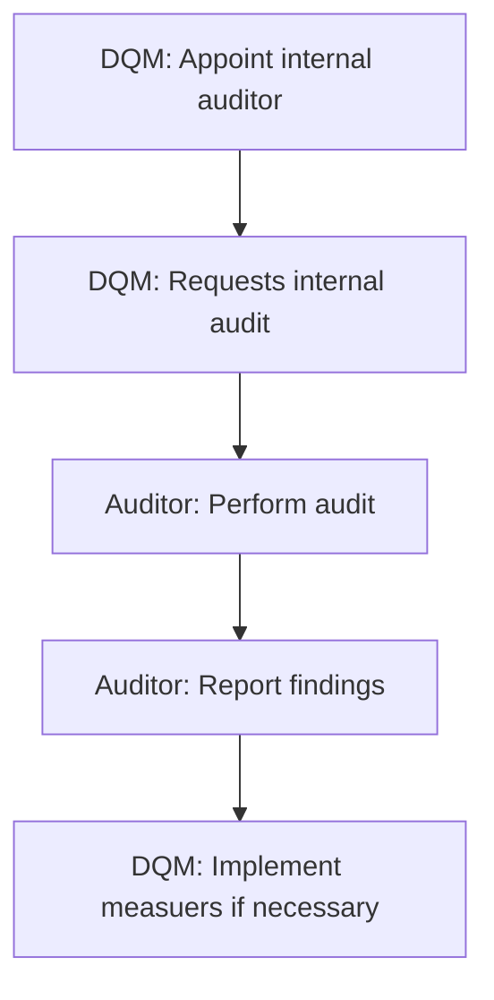
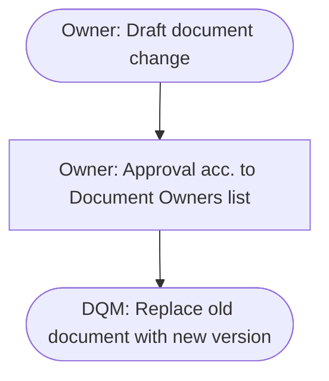

# Quality Management Flowchart

## Internal audit

```mermaid
graph TD;
    PICK_AUDITOR[DQM: Appoint internal auditor]-->AUDIT_APOINTMENT[DQM: Requests internal audit];
    AUDIT_APOINTMENT-->AUDIT[Auditor: Perform audit];
    AUDIT-->FINDING[Auditor: Report findings];
    FINDING-->IMPROVEMENT[DQM: Implement measuers if necessary];
```

## Document management

```mermaid
graph TD;
    DOCUMENT_OWNER_CHANGES([Owner: Draft document change])-->APPROVAL[Owner: Approval acc. to Document Owners list];
    APPROVAL-->UPDATE([DQM: Replace old document with new version]);
```
