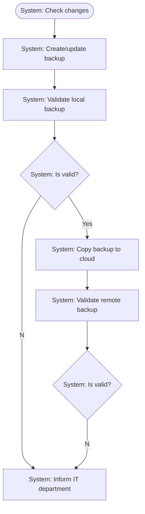
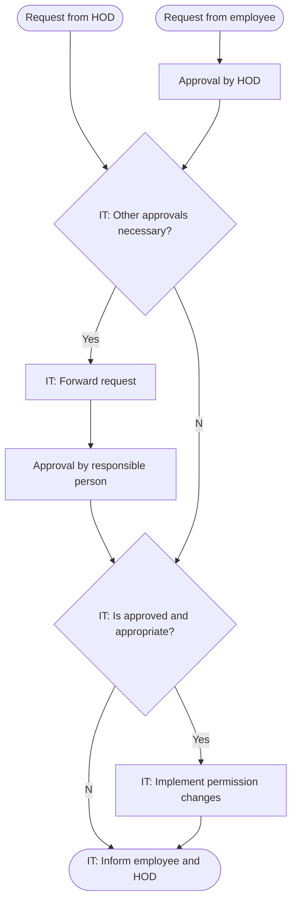
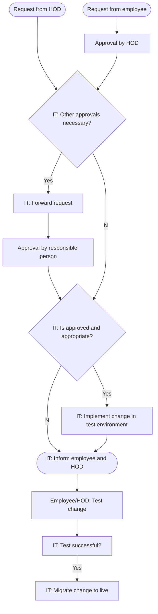

# IT Flowchart

## Daily backup

```mermaid
graph TD;
    CHECK_CHANGES([System: Check changes])-->CREATE_LOCAL_BACKUP[System: Create/update backup];
    CREATE_LOCAL_BACKUP-->VALIDATE_LOCAL[System: Validate local backup];
    VALIDATE_LOCAL-->IS_VALID1{System: Is valid?};
    IS_VALID1--Yes-->COPY_ONLINE[System: Copy backup to cloud];
    IS_VALID1--No-->REPORT[System: Inform IT department];
    COPY_ONLINE-->VALIDATE_ONLINE[System: Validate remote backup];
    VALIDATE_ONLINE-->IS_VALID2{System: Is valid?};
    IS_VALID2--No-->REPORT;
```

## Permission changes

```mermaid
graph TD;
  REQUEST_HOD([Request from HOD])--->IT_CHECKS{IT: Other approvals necessary?};
  REQUEST_STAFF([Request from employee])-->APPROVAL_HOD[Approval by HOD];
  APPROVAL_HOD-->IT_CHECKS;
  IT_CHECKS--Yes-->FORWARD[IT: Forward request];
  FORWARD-->APPROVAL_RESPONSIBLE[Approval by responsible person];
  APPROVAL_RESPONSIBLE-->VALIDATE{IT: Is approved and appropriate?};
  IT_CHECKS--No-->VALIDATE;
  VALIDATE--Yes-->IMPLEMENT[IT: Implement permission changes];
  VALIDATE--No-->INFORM([IT: Inform employee and HOD]);
  IMPLEMENT-->INFORM;
```

## Software changes

```mermaid
graph TD;
  REQUEST_HOD([Request from HOD])--->IT_CHECKS{IT: Other approvals necessary?};
  REQUEST_STAFF([Request from employee])-->APPROVAL_HOD[Approval by HOD];
  APPROVAL_HOD-->IT_CHECKS;
  IT_CHECKS--Yes-->FORWARD[IT: Forward request];
  FORWARD-->APPROVAL_RESPONSIBLE[Approval by responsible person];
  APPROVAL_RESPONSIBLE-->VALIDATE{IT: Is approved and appropriate?};
  IT_CHECKS--No-->VALIDATE;
  VALIDATE--Yes-->IMPLEMENT[IT: Implement change in test environment];
  VALIDATE--No-->INFORM([IT: Inform employee and HOD]);
  IMPLEMENT-->INFORM;
  INFORM-->TEST[Employee/HOD: Test change];
  TEST-->VALIDATE_TEST[IT: Test successful?];
  VALIDATE_TEST--Yes-->MIGRATE[IT: Migrate change to live];
```

2022-01-01 - Version 1.0

