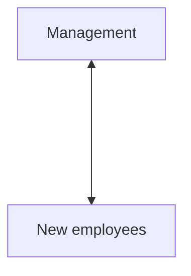
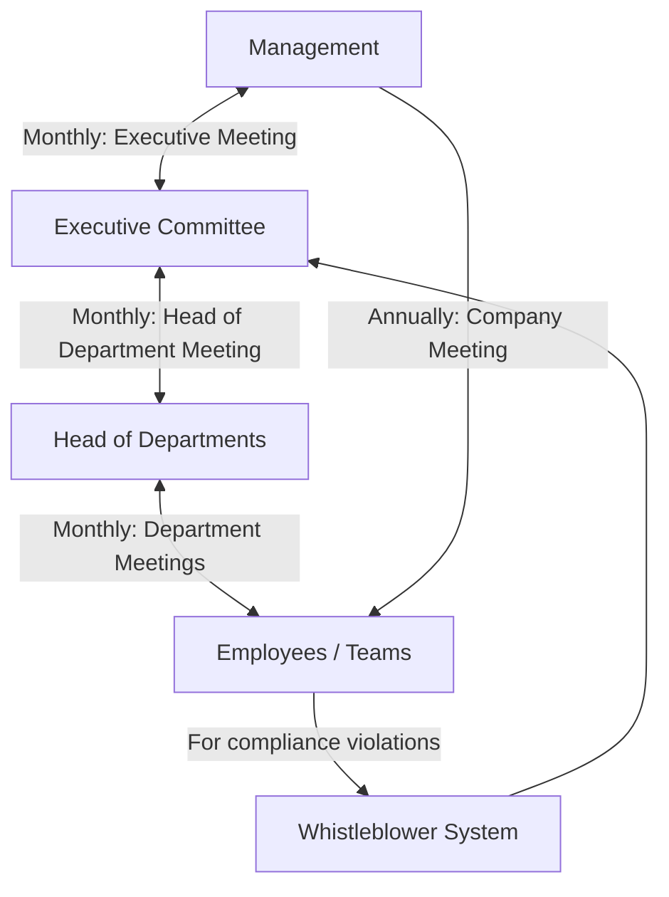

# Information Flow

## Onboarding Meetings

```mermaid
flowchart TD;
    MANAGEMENT[Management]<---->EMPLOYEES[New employees]
```

## Regular Meetings

```mermaid
flowchart TD;
    MANAGEMENT[Management]<--Monthly: Executive Meeting-->EXECUTIVE_COMMITTEE[Executive Committee]
    EXECUTIVE_COMMITTEE<--Monthly: Head of Department Meeting-->HEAD_OF_DEPARTMENTS[Head of Departments]
    HEAD_OF_DEPARTMENTS<--Monthly: Department Meetings-->EMPLOYEES[Employees / Teams]
    MANAGEMENT--Annually: Company Meeting-->EMPLOYEES
    EMPLOYEES--For compliance violations-->WHISTLEBLOWER[Whistleblower System]
    WHISTLEBLOWER-->EXECUTIVE_COMMITTEE
```

2024-03-20 - Version 2.0
