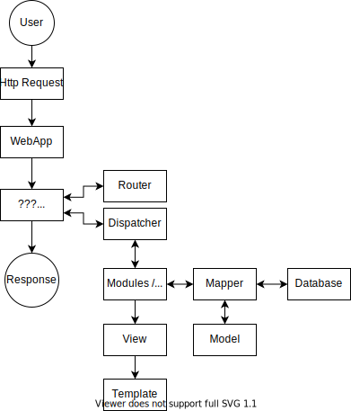

# Onboarding: Q&A

## General Application Questions

**Explain the general structure of the application**

* WebApplication -> e.g. Backend/Application -> Modules
* WebApplication -> e.g. Api/Application -> Modules

**Where are the application models e.g. Cache, DataMapper, Routing, Dispatching, ... initialized?**

In the respective Application (e.g. Backend/Application)

**Draw a general request workflow**

**Explain the general structure of a module and its purposes**

* Admin: Contains routs, installation, update and status change scripts
* Controller: Contains the different controllers (e.g. BackendController, ApiController)
* Docs: Contains the dev and user documentation in the different languages
* Models: Contains the models
* tests: Contains the tests
* Theme: Contains the themes (tpl, css, js, language files)
* .github: Github specific scripts and files
* Root directory: Mainly contains license, readme, contributing and most importantly the `info.json` file which describes the module requirements. This file is also used during the installation process of the module

## Resources

**Which frameworks are used for this project?**

Only the in-house frameworks (phpOMS, jsOMS, cssOMS, cOMS)

**Does the release version (not the development tools) use external / third-party resources?**

Yes, although only very few libraries. They can be found in Resources/ and Libraries/.

## Code Inspections

**How can you check the code style for code you wrote?**

* Guidelines
* Just run the phpcs and eslint dev tool with the provided config
* run: `Build/Helper/testreport.sh`

**How can you check the code quality for code you wrote?**

* Guidelines
* Unit / integration tests (php: PHPUnit, js: jasmine)
* Static code analysis (phpstan, eslint)
* run: `Build/Helper/testreport.sh`
* run: `php -d pcov.enabled=1 vendor/bin/phpunit tests/phpunit_default.xml`
  * It's recommended to run this in the Karaka/* main directory
  * Running this in the main directory will run all tests, also for the submodules (e.g. phpOMS, Modules, ...)

**Where are the config files for the different developer tools**

* phpcs: Build repository
* phpstan: Build repository
* eslint: Build repository
* PHPUnit: respective repository
