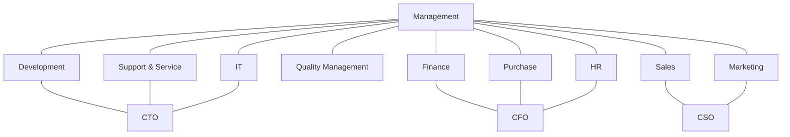

# Organigram

```mermaid
graph TD;
    MANAGEMENT[Management]---DEVELOPMENT[Development];
    MANAGEMENT[Management]---SUPPORT_SERVICE[Support & Service];
    MANAGEMENT[Management]---IT[IT];
    MANAGEMENT[Management]---QM[Quality Management];
    MANAGEMENT[Management]---PURCHASE[Purchase];
    MANAGEMENT[Management]---FINANCE[Finance];
    MANAGEMENT[Management]---HR[HR];
    MANAGEMENT[Management]---SALES[Sales];
    MANAGEMENT[Management]---MARKETING[Marketing];
    DEVELOPMENT---CTO[CTO]
    SUPPORT_SERVICE---CTO
    IT---CTO
    FINANCE---CFO[CFO]
    PURCHASE---CFO
    HR---CFO
    SALES---CSO[CSO]
    MARKETING---CSO
```

2022-01-01 - Version 1.0
