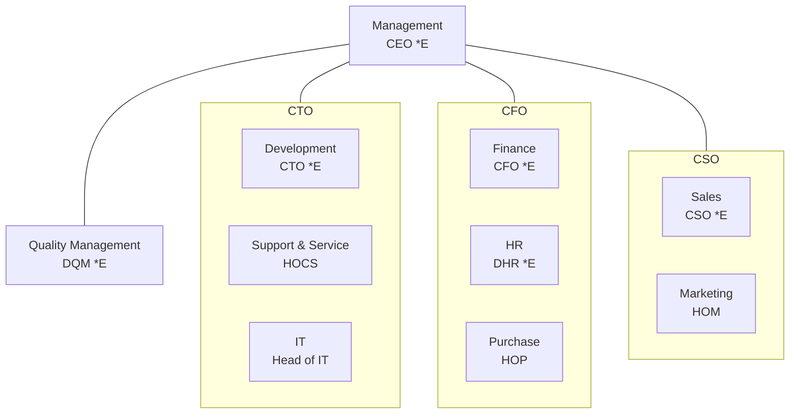

# Organigram

```mermaid
flowchart TD;
    subgraph CTO
        DEVELOPMENT[Development\nCTO *E];
        SUPPORT_SERVICE[Support & Service\nHOCS];
        IT[IT\nHead of IT];
    end
    MANAGEMENT[Management\nCEO *E]---CTO;
    subgraph CFO
        FINANCE[Finance\nCFO *E];
        HR[HR\nDHR *E];
        PURCHASE[Purchase\nHOP];
    end
    MANAGEMENT---CFO;
    subgraph CSO
        SALES[Sales\nCSO *E];
        MARKETING[Marketing\nHOM];
    end
    MANAGEMENT---CSO;
    MANAGEMENT---QM[Quality Management\nDQM *E];
```

\*E: Executive Committee Member

2022-01-01 - Version 1.0

