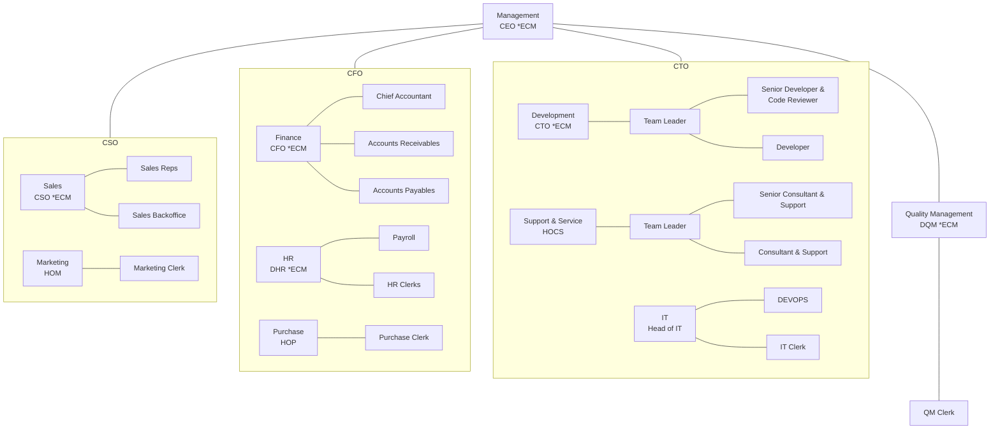

# Organigram

\*E: Executive Committee Member

## Key Functions

| Title                         | Name(s) |
| ----------------------------- | ------- |
| CEO                           |         |
| DQM                           |         |
| CTO                           |         |
| HOCS                          |         |
| Head of IT                    |         |
| CFO                           |         |
| DHR                           |         |
| HOP                           |         |
| CSO                           |         |
| HOM                           |         |
| Export Control Officer        |         |
| Fleet Manager                 |         |
| QMR                           |         |
| Emergency Responder           |         |
| Work Safety Officer           |         |
| Safety Officer                |         |
| Data Protection Officer       |         |
| Company Physician             |         |
| Waste Management Officer      |         |
| Fire Prevention Officer       |         |
| Equal Opportunities Officer   |         |
| Ladder Officer                |         |
| Officer for Severely Disabled |         |
| Internal Auditor              |         |
| Compliance Manager            |         |

## Responsibilities

Additional responsibilities are defined in the respective process documentation, [Document Owners](./Document%20Owner.md) and individual employee contracts.

2022-01-01 - Version 1.0

