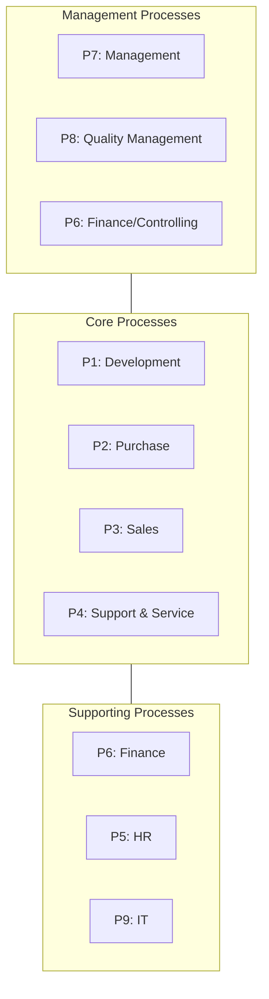

# Process Structure

```mermaid
flowchart TD;
    subgraph Management[Management Processes];
        MGM[P7: Management];
        QM[P8: Quality Management];
        CONTROLLING[P6: Finance/Controlling];
    end;
    subgraph Core[Core Processes];
        DEVELOPMENT[P1: Development];
        PURCHASE[P2: Purchase];
        SALES[P3: Sales]
        SUPPORT[P4: Support & Service];
    end;
    subgraph Supporting[Supporting Processes];
        FINANCE[P6: Finance];
        HR[P5: HR];
        IT[P9: IT];
    end;
    Management---Core;
    Core---Supporting;
```

2022-01-01 - Version 1.0
