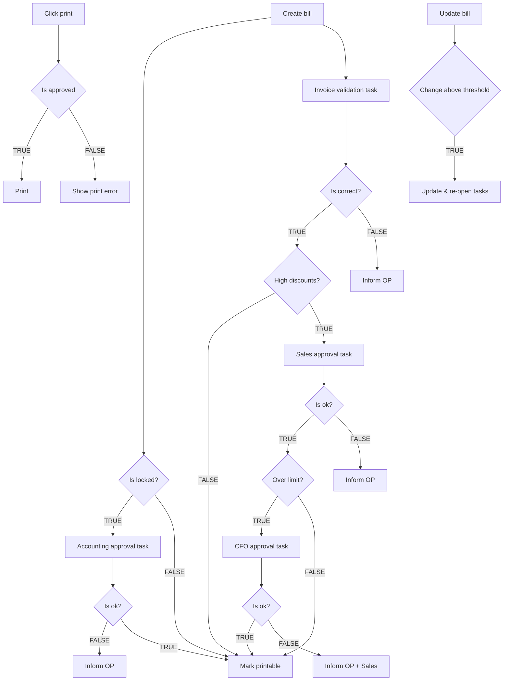

```mermaid
flowchart TB
	CREATE_BILL[Create bill]-->LOCKED{Is locked?}
	LOCKED-->|TRUE|CREATE_APPROVAL_TASK[Accounting approval task]
	LOCKED-->|FALSE|PRINTABLE
	CREATE_APPROVAL_TASK-->ACCOUNTING_APPROVAL{Is ok?}
	ACCOUNTING_APPROVAL-->|FALSE|ACCOUNTING_NOT_APPROVED[Inform OP]
	ACCOUNTING_APPROVAL-->|TRUE|PRINTABLE
	CREATE_BILL-->CREATE_CHECK_TASK[Invoice validation task]
	CREATE_CHECK_TASK-->BILL_CHECK{Is correct?}
	BILL_CHECK-->|TRUE|CHECK_PRICES{High discounts?}
	CHECK_PRICES-->|FALSE|PRINTABLE
	BILL_CHECK-->|FALSE|INFO_WRITER[Inform OP]
	CHECK_PRICES-->|TRUE|CREATE_SALES_APPROVAL_TASK[Sales approval task]
	CREATE_SALES_APPROVAL_TASK-->SALES_APPROVAL{Is ok?}
	SALES_APPROVAL-->|TRUE|CHECK_PRICES_ESCALATED{Over limit?}
	SALES_APPROVAL-->|FALSE|SALES_NOT_APPROVED[Inform OP]
	CHECK_PRICES_ESCALATED-->|TRUE|CREATE_CFO_PRICE_APPROVAL[CFO approval task]
	CHECK_PRICES_ESCALATED-->|FALSE|PRINTABLE
	CREATE_CFO_PRICE_APPROVAL-->CFO_APPROVAL{Is ok?}
	CFO_APPROVAL-->|TRUE|PRINTABLE[Mark printable]
	CFO_APPROVAL-->|FALSE|CFO_NOT_APPROVED[Inform OP + Sales]
	
	CLICK_PRINT[Click print]-->IS_APPROVED{Is approved}
	IS_APPROVED-->|TRUE|PRINT[Print]
	IS_APPROVED-->|FALSE|PRINT_ERROR[Show print error]

	UPDATE_BILL[Update bill]-->CHECK_THREASHOLDS{Change above threshold}
	CHECK_THREASHOLDS-->|TRUE|OPEN_TASKS[Update & re-open tasks]
```

