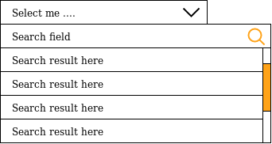
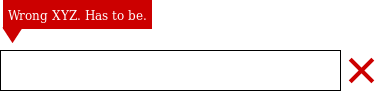
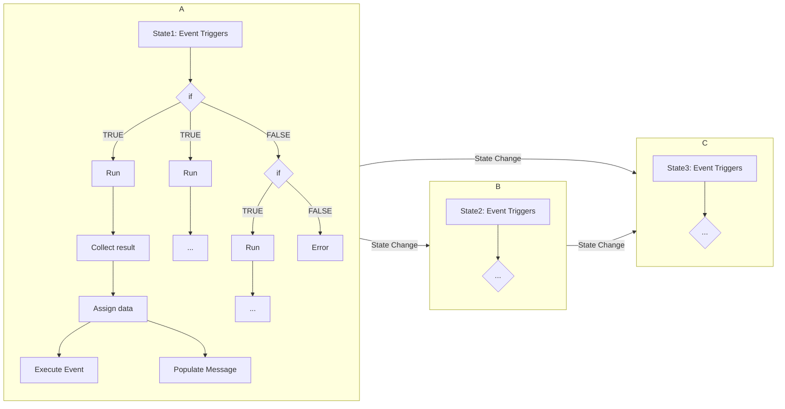

# Project Status and Tasks

- [Summary](#summary)
- [Latest changelog](#latest-changelog)
- [Key tasks](#key-tasks)
- [Todos](#todos)
- [Bugs](#bugs)
- [Drafts, concepts & ideas](#drafts-concepts-ideas)

## Summary

Last update of this file: 2022.05.01

## Latest changelog

### July 2022

#### New

##### Application

* Implement table sorting
* Created alpha version of OCRImageOptimizerApp (cli for image optimization for OCR)

##### Auditor

* Turned auditing data from text to blob and compressed it resulting in a storage reduction by approx. 75% - 80%

##### Framework

* Hard limit JSON requests and urldata to 1MB
* Add basic kernel support in cOMS

#### Bug fixes

##### Framework

* 

#### Other

## Challenges & problems

### UI

* Adding existing events to dynamically added DOM elements becomes a real problem.
  * Solution: Implement event bubbling

## Key tasks

| Priority   | Category                                 | Task                                                         |
| ---------- | ---------------------------------------- | ------------------------------------------------------------ |
| 2022.08.27 | Scope                                    | Which modules should be developed first                      |
| 2022.08.27 | Scope                                    | Which features must be part of the modules at the start      |
| 2022.08.27 | Scope                                    | What is the expected timeline for the different modules      |
|            | Navigation                               | Allow to hide navigation elements even if the module is installed |
|            | Navigation                               | Also disable routing for front end. This way only the functionality is available (api) |
|            | Customer Management                      | Implement names, address, contact elements                   |
|            | Customer Management                      | Implement custom fields                                      |
|            | Job                                      | Manage jobs                                                  |
|            | Job                                      | Consider to combine Job and Workflow (e.g. job only schedule + cmd, workflow is the script to execute) |
|            | Tag                                      | Implement a tag search hook which finds content based on tags |
|            | Search                                   | Implement a search result page which gets populated from api search responses. The search result should have two templates (list and module specific). The list is just a simple link list, the module specific table groups the results from the different modules together and allows every module to show their result list in a special way (e.g. media files, tasks, ...). |
|            | UI Select                                | Create a select with a search field (data can be remote or local), with mandatory option, with selected default value  |
|            | UI / Forms                               | Elements added to the DOM should automatically get bound (e.g. use event bubbling) |
|            | UI / Forms                               | Implement local (inline and external)+remote add function    |
|            | UI / Forms                               | Implement local (inline and external)+remote update function |
|            | UI / Forms                               | Implement local + remote delete function                     |
|            | UI / Forms                               | Redirect to other page after success (define data-redirect?) |
|            | UI / Tables                              | Implement local + remote re-order                            |
|            | UI / Tables                              | Implement local + remote sort (make remote request, and add data to table) |
|            | UI / Tables                              | Implement local + remote filter (make remote request, and add data to table) |
|            | UI / Tables                              | Highlight filtered columns so the user can see the filtering |
|            | UI / Tables                              | Implement export to excel, csv (maybe pdf?)                  |
|            | UI / Badge Input                         | Implement default badges                                     |
|            | UI / Badge Input                         | Implement mandatory badges                                   |
|            | UI / Badge Input                         | Implement removing badges local + remote                     |
|            | Permission                               | Better permission handling (only show tickets the user is allowed to see) **difficult** |
|            | Permission                               | When returning models (backend and api requests) the permission should be checked (all modules) |
|            | Permission                               | After completely figuring out permissions every api function needs to be checked if it behaves correctly depending on the different permissions (e.g. user created the model, user who is allowed to access the model but not change it, ...) |
|            | Customer Management (SD)                 | Contract import from CRM system (maintenance contract)? *(SD specific)* |
|            | Exchange (Importer/Exporter) (SD)        | GSD import script for customers (new entries and changed entries) *(SD specific)* |
|            | Exchange (Importer/Exporter) (SD)        | GSD import script for customer addresses (new entries and changed entries) *(SD specific)* |
|            | Exchange (Importer/Exporter)             | Allow to define exchange scripts as auto-run with a interval |
|            | Admin                                    | [UI] Add user & group settings                               |
|            | Admin                                    | [UI] Add account/group removal from each other               |
|            | Admin                                    | [UI] Add permission removal from accounts/groups             |
|            | Admin                                    | [UI] Add permission modification for accounts/groups         |
|            | Admin                                    | Create api key/token permissions                             |
|            | Admin                                    | Create api key/token handling                                |
|            | Admin                                    | Handle logging for api keys/tokens                           |
|            | Admin                                    | Handle "login" for api keys/tokens (maybe create dummy account for that?) |
|            | Support                                  | Ticket creation                                              |
|            | Support                                  | Ticket response                                              |
|            | Support                                  | Status update via email (customer)                           |
|            | Support                                  | Feedback/rating via email click (using time limited hash) **difficult** |
|            | Support                                  | Response from customer via email (using time limited hash). Requires ticket email address, maybe create one per app? **difficult** |
|            | Support                                  | Upload files to random support directory                     |
|            | Support                                  | Allow ticket creation from external sources (e.g. website) by using an api key. Allow custom fields in this form as well. |
|            | Templates, Controllers, Views and Models | Allow custom templates, controllers, views and models, which don't get replaced during updates (e.g. for ItemManagement, CustomerManagement, HR, ...). These should be stored in a directory called `Customized` in the parent directories *Controller*, *Themes*, *Views* and *Models*. Whenever a custom controller is uploaded/changed the routes of all the applications need to be checked and adjusted. |
|            | Media                                    | Drag and drop upload                                         |
|            | Media                                    | Ctr+C/Ctrl+V upload                                          |
|            | Media                                    | Move files and directories to subdirectories (drag/drop and Ctrl+C/Ctrl+V) |
|            | Media                                    | Bulk actions (move, delete, download, ...)                   |
|            | Media                                    | Better file and directory permissions. Similar problem applies to permissions. **difficult due to subdirs** |
|            | Media                                    | Implement download of directory                              |
|            | Media                                    | Add password support for directories.     > Difficult because of subdirectories |
|            | Media                                    | Allow to actually replace media files (same DB id but replaced the file on the hard drive) |
|            | Media                                    | Allow links as media files (e.g. use path). If a link is detected it should forward to that link, this would also allow other modules to create pseudo media elements e.g. helper/editor. Upon clicking on it e.g. the editor is opened. This would mean the editor needs to create this media model whenever the user creates a document. The path needs to be the same as in the moduel itself e.g. Accounts/... or whatever the user defined as path in the module itself. The url should be relative e.g. /editor?id={id} which makes it domain name independent. |
|            | Media                                    | Allow to create a collection when uploading multiple files   |
|            | Contract Management                      | Show contracts after clicking on document list in contract   |
|            | Contract Management                      | Create task/message if a contracts term runs out             |
|            | Contract Management                      | Create job which informs people about contract end of life   |
|            | Contract Management                      | Setting to change responsible person/group A to B (e.g. person leaves company) |
|            | Contract Management                      | Implement directory view for contracts                       |
|            | System                                   | Create frontend event which checks for server messages regularly (e.g. server goes into maintenance/read-only mode) |
|            | Workflow                                 | Individual UI templates incl. styles                         |
|            | Workflow                                 | Script management                                            |
|            | Workflow                                 | Allow email message and response (text+time limited links via hash) |
|            | Invoice Management                       | OCR                                                          |
|            | Invoice Management                       | Auto content recognition (supplier, articles, costs, taxes, payment terms) |
|            | Invoice Management                       | Define approval workflow                                     |
|            | Invoice Management                       | Allow notes                                                  |
|            | Invoice Management                       | Allow questions to other users (reference tasks and or media messages) |
|            | Invoice Management                       | Allow to add additional documents (maybe create root invoice element if multiple bills reference each other?) |
|            | Invoice Management                       | Allow PDF modifcation (allow notes on pdf, approval stamps) **difficult**   > This requires a JS live preview for adding this at a specific position (maybe PDFJSAnnotate, maybe customize pdf.js) |
|            | Invoice Management                       | Job/Schedule which checks unhandled invoices                 |
|            | Invoice Management                       | Hooks/Workflows for invoices                                 |
|            | Invoice Management                       | Job/Schedule which checks unhandled invoices                 |
|            | Quality Management                       | Create quality issue (for account, article, other?)          |
|            | Quality Management                       | Define workflow based on report type?                        |
|            | Quality Management                       | Statistics ???                                               |
|            | Quality Management                       | Expand GSD Exchange importer *a lot of work* *(SD specific)* |
|            | Workflow                                 | Remove article. How to handle data (custom database table?)  |
|            | Workflow                                 | Create article. How to handle data (custom database table?)  |
|            | Customer Management (SD)                 | Expand GSD Exchange importer to also import customer files from CRM (files, emails) |
|            | Customer Management (SD)                 | Expand GSD Exchange importer to also import customer notes (notes, visitor reports) |
|            | Sales                                    | Create easy way to create quick visitor reports (= maybe use notes for this with a type 'visit') |
|            | Sales                                    | Allow to create visitor report on cell phone by using location matching (geolocation) |
|            | Sales                                    | Analyze reports per sales rep (e.g. use filter for export?)  |
|            | Item Management                          | Implement Names, base data, media files                      |
|            | Item Management                          | Implement parent item which can hold information (e.g. files) which can be used across all children |
|            | Item Management (SD)                     | Expand GSD Exchange importer to also import articles *(SD specific)* |
|            | Billing                                  | Basic invoice data (no stock movement)                       |
|            | Billing (SD)                             | Expand GSD Exchange importer to bills *(SD specific)*        |
|            | Billing                                  | Bill expenses such as insurance, freight, etc. also need VAT percentages. Best would be to create cost types, this would allow to add multiple freight expenses and print them below the invoice |
|            | Billing                                  | Show invoice pdf in preview on change                        |
|            | Sales                                    | Sales rep ranking                                            |
|            | Sales                                    | Individual rep sales analysis (e.g. top customers, sales by product group, lost customers, ...) |
|            | Customer Management                      | Customer sales info/statistics (total sales, invoices, articles, groups) |
|            | Customer Management (SD)                 | Invoice pdf importer from hard drive (without using the Exchange module) *(SD specific)* |
|            | Customer Management                      | Create a view where you can see all bills of the customer    |
|            | Customer Management                      | Create a view where you can see all items of the customer    |
|            | Sales Analysis (customer)                | Sales + Gross profit                                         |
|            | Sales Analysis (customer)                | Quantity orders + quantity articles                          |
|            | Sales Analysis (customer)                | Segment sales                                                |
|            | Sales Analysis (customer)                | Top articles                                                 |
|            | Sales Analysis (customer)                | Cross selling (bought as well)                               |
|            | Sales Analysis (customer)                | Amount of invoices                                           |
|            | Sales Analysis (customer)                | Amount of different articles                                 |
|            | Sales Analysis (item)                    | Sales + gross profit                                         |
|            | Sales Analysis (item)                    | Quantity sales                                               |
|            | Sales Analysis (item)                    | Amount of customers                                          |
|            | Sales Analysis (item)                    | Cross selling                                                |
|            | Sales Analysis (item)                    | Top customers                                                |
|            | Sales Analysis (item)                    | Amount of article sales                                      |
|            | Sales Analysis (item)                    | Amount of new customers                                      |
|            | Sales Analysis (item)                    | Amount of lost customers                                     |
|            | Job                                      | Create job which can automatically create checklists (e.g. end of month checklists) |
|            | Checklist                                | Create module                                                |
|            | Checklist                                | Checklists can create tasks, the tasks can (optionally) have an effect on the checklist status |
|            | Checklist                                | Checklists can be modified by assigned users/all users who have permission for the checklist |
|            | Checklists                               | Allow to define recurring date/time                          |
|            | Marketing                                | Create promotions (incl. basic info)                         |
|            | Marketing                                | Promotion type (somehow use for cost center)                 |
|            | Marketing                                | Create events (incl. basic info)                             |
|            | Marketing                                | Event types (somehow use for cost center)                    |
|            | Human Resource Management                | Handle staff information (encrypted)                         |
|            | Human Resource Management                | Handle staff positions                                       |
|            | Human Resource Management                | Manage documents (encrypted)                                 |
|            | Human Resource Management                | Manage contracts (encrypted)                                 |
|            | Human Resource Management                | Manage salary (encrypted)                                    |
|            | Human Resource Management                | List of assets and documents handed over to employees (to be returned on leave) |
|            | Item Management                          | Add an area for markers (e.g. not sold for a x month, not purchased for x month, bad margin... etc.)  Similar to an alarm system (maybe green, yellow, red markers?) |
|            | Item Management                          | Consider to use name for attribute identification (currently only used for localization). Is this really required?id might be fine? |
|            | Item Management                          | Add an area for markers (e.g. not sold for a x month, not purchased for x month, bad margin... etc.) Similar to an alarm system (maybe green, yellow, red markers?) |
|            | Item Management                          | Create a second optional list view where the item is shown at the bottom of the list which allows the user to the the item list at the top and the item itself below. Either create a custom view or somehow append an iframe below the list which is loaded based on the selected item |
|            | Human Resource Clocking                  | Basic clocking (browser + hardware)                          |
|            | Human Resource Clocking                  | Hardware needs to make web requests for the chip clocking    |
|            | Human Resource Clocking                  | Clocking overview for employees                              |
|            | Human Resource Clocking                  | Vacation / absence management for employees                  |
|            | Human Resource Clocking                  | Clocking overview/analysis for managers/hr                   |
|            | Human Resource Clocking                  | Vacation / absence overview/analysis for managers/hr         |
|            | Human Resource Clocking                  | Vacation approval workflow                                   |
|            | Human Resource Clocking                  | Clocking change approval                                     |
|            | Human Resource Clocking                  | Export of clocking times (hr)                                |
|            | Human Resource Clocking                  | Export of vacations, sickness, ... (hr)                      |
|            | Dashboard                                | Drag&Drop element sometimes disappear on drop                |
|            | Dashboard                                | Create default dashboard templates which can be used by users, changing them copies it for this user |
|            | Dashboard                                | Allow people to modify a dashboard and automatically save it / reload it |
|            | Dashboard                                | Implement a way for other modules to provide dashboard components (allow modules to register themselves in a database table) |
|            | Billing                                  | Only create pdf preview if preview is visible?               |
|            | Billing                                  | [Analysis] Gross profit (total bill and elements)            |
|            | Billing                                  | Show bill relations (on tab which shows all related bills)   |
|            | Billing                                  | Create send as email button inside the bill. this opens the send email view where the email is pre-written with the attached pdf |
|            | Billing                                  | In the supplier and client view you should be able to select multiple bills and click print for printing |
|            | Billing                                  | In the supplier and client view you should be able to select multiple bills and click send as email for email sending |
|            | Billing                                  | The send bill as email should have a global settings where you can either define a global email or empty = user specific email |
|            | Billing                                  | Sending emails should have a default email format and a default invoice naming convention, additionally there should be the option to define a user specific email text and pdf naming convention |
|            | Billing                                  | Clients should have a invoice_email address which is stored in the client |
|            | Billing                                  | Allow to define re/usable templates (e.g. recurring invoices) |
|            | Billing                                  | Allow to define re/usable texts                              |
|            | Billing                                  | Automatic email invoice after finishing if user wants to use that |
|            | Billing                                  | Batch print/export invoices based on filter                  |
|            | Billing                                  | Bill element sorting should have a small bar at the beginning of every element which allows the user to drag/drop the element up or down. Of course the up/down arrows which are currently implemented should remain. |
|            | Billing                                  | Forward bills to sales rep (if bill > X EUR or specific type) |
|            | Billing                                  | Implement approval concept for invoices and invoice elements (e.g. price, tax, margin etc.). The problem is that different changes may require different responsible people to approve this,  this means you would need some indication which shows which approval is still outstanding. Of course a less detailed visual indication would be a red, yellow, green marker at the beginning of the invoice/element or background highlight |
|            | Billing                                  | Allow to import existing bills (e.g. order -> invoice, offer -> confirmation -> delivery note ...) Share media files between imported bills for easier searching. Maybe do this by creating a root element which all bills reference and show files of this root bill? |
|            | Billing                                  | Show list for recommended purchase items + type tags e.g. re-order because empty, cross selling, promotion (if promotion already used, don't offer any longer) |
|            | Billing                                  | BillTypes should have stock movement types assigned to them  |
|            | Warehouse Management (SD)                | Implement stock GSD stock importer *(SD specific)*           |
|            | Purchasing                               | Create item list for purchasing                              |
|            | Accounting (SD)                          | Implement GSD accounting importer *(SD specific)*            |
|            | Accounting                               | Print receivable of customer (also allow to do this from the client view in the Client Management) |
|            | Client Management                        | Create a map of all customers (maybe as data points or as heat maps) |
|            | Client Management                        | Create a map of sales (maybe as data points or as heat maps) |
|            | Client Management                        | Create default letter Doc (with/without letter head)         |
|            | Client Management                        | Add list for top articles on profile page... important for customer calls |
|            | Client Management                        | Add list for recommended purchase items + type tags e.g. re-order because empty, cross selling, promotion (if promotion already used, don't offer any longer) |
|            | Client Management                        | Create a simple button to send an email to a customer, this also should have the option to change the mail address (e.g. drop down with all available email addresses and option to manually write it) |
|            | Client Management                        | Add a geo map of the customers location (either on a real map or on the already added SVG maps) |
|            | Client Management                        | Make customers only visible/readable to authorized people (e.g. sales rep may only see his own clients) |
|            | Client Management                        | Client view should be customizable since different groups have different interests and read permissions (e.g. sales reps, finance, etc.) |
|            | Client Management                        | Allow to specify the accounting account (e.g. a customer who is a supplier may have the same account) |
|            | Accounting Analysis                      | Create different P&L structures                              |
|            | Accounting Analysis                      | Create different balance structures                          |
|            | Accounting Analysis                      | Create cash analysis structure                               |
|            | Accounting Analysis                      | Create asset/depreciation structure                          |
|            | Accounting Analysis                      | Create comparison feature for the above mentioned structures (budget, IFRS, ...) |

#### Archived

| Deadline | Done | Category | Task |
| -------- | ---- | -------- | ---- |
|          |      |          |      |

## Todos

Todos/tasks which are not important enough to be part of the milestones (or don't impact the milestone progression significantly).

| Priority | Category                   | Task                                                         |
| -------- | -------------------------- | ------------------------------------------------------------ |
| high     | Forms                      | Invalid api responses should undo the UI changes             |
| high     | Forms                      | Adding a template to the DOM should modify its id/generate a custom/random id for the added element |
| high     | Forms                      | If a form has unsaved content the browser should ask if the user really wants to change the page or close it (use beforeunload event). |
| medium | Job | Consider to run jobs through the cli application. This means a job executes `php cli.php put:/admin/job -i 3` which runs the command of job 3. This would allow to log the job execution time and response. If you don't want to wait for the execution to finish you may as well run it async (this means of course no execution time or output can be logged, but at least the start time). |
| medium | Form/Table | Implement a filter highlight function (either in forms or in tables, where the filter icon is highlighted, if a filter is defined). One solution could be to put an additional hidden filter checkbox in front of the filter icon and check for filter changes (bubble up) and then activate this hidden checkbox if a filter is defined. In css just define the filter icon as active/highlighted, if the hidden check box is active. This means we have two hidden checkboxes in front of the filter icon (one in case the filter menu is open = popup is visible and another one for highlighting the filter icon if a filter is defined). |
| medium | Form/Table | How to preserve form filter data to the next page? Not an issue, in the future we don't want to reload the whole page, but only exchange the table/list content with the backend response -> the header/filter will not get changed and remains as defined. This means for tables (maybe even forms?) to setup content replacement earlier than for other pages?! |
| medium | CMS | Create functionality which allows to replace application files. Instead of just overwriting them they get backed up in a backup directory. |
| medium | UI select | Bind data to select options such as visible elements and data pre-fills. When an option is selected certain ui elements become visible and get filled out with default values. |
| medium | phpOMS | Implement Redis / memcached sessions |
| medium | Knowledgebase | Add org ID to wiki app (optional) and add a default flag. In the backend load the default wiki app for the current organization `$this->app->orgId` |
| medium | Tasks | Allow to create a reminder for a task (e.g. small bell next to the user name which highlights the task/removes the has_seen flag + says somewhere you got remindered) |
| medium | Tasks | Create different overviews list by date + list by priority (very high + next day, high + next 2 days, medium + next 5 days, low + next 10 days, very low + remaining). Of course the grouping may change based on how long ago the creation date is. |
| medium | Tasks | Show stats at the top (e.g. open, in progress, maybe even open high priority) |
| medium | Billing | Allow to define multiple documents which are created upon invoice completion. Right now only the internal invoice document is generated. |
| medium | Push/pull content | Auto update data changes in the backend (e.g. pull every x seconds, or use websockets for push) |
| medium | Concurrency lock | Lock data for concurrency (e.g. table row lock or heartbeat) |
| medium   | Logs                       | Immediately send errors also via email to the admin/server email address if it is configured that way (maybe create callback global and for different log levels). |
| medium   | Url format                 | Change the url format in most modules from query parameter to path (e.g. `/module/profile?id=Admin` to `/module/Admin/profile`) |
| medium   | Modules                    | Many models would benefit from unit and app association. Sometimes models should only be available/associated with a specific unit (e.g. news article for website, backend, shop etc.) |
| medium   | Frontend Action            | Create an action which adds/removes DOM elements             |
| medium   | Frontend Action            | Log DOM changes to the user                                  |
| medium   | Modules                    | Find a way to handle optional modules (e.g. comment module in the news module) in the past the Mapper was modified (comments were removed) if the comment module was installed. Somehow this is no longer available but maybe another solution could be a different Mapper which is replaced if the comment module is installed. But instead of replacing a complete file, a diff should be generated between the files and the ADDED lines should be merged. How to handle uninstall because here it doesn't work? I would need to know exactly what to remove. |
| medium   | DataMapper                 | In the DataMapper implement iterable fetch. Currently all models are returned in one go, additionally an iterator should be returned for iterable access in case of MANY results (e.g. Exchange module). Maybe add mapper function (`->iterable()` which then returns an iterator after `->execute()`) |
| medium   | Editor             | Create immediate text preview similar to a rich text editor or Typora. |
| medium | Editor | Add inline charts (e.g. [Mermaid](https://github.com/mermaid-js/mermaid) and [Toast UI Chart](https://github.com/nhn/tui.chart)) |
| medium | Editor | Add math formulas (e.g. [Katex](https://katex.org/)) |
| medium | Editor | Add emojis (https://www.freecodecamp.org/news/all-emojis-emoji-list-for-copy-and-paste/) |
| medium   | Admin              | Create a view where it's possible to create/activate, change and delete/deactivate hooks for events. |
| medium | EventManagement | Use Cli application for async event handling, alternatively web requests via curl, alternatively at runtime of the main process. This should depend on the configuration of the application. |
| low | Markdown lists | Implement aligned ul https://stackoverflow.com/questions/10428720/how-to-keep-indent-for-second-line-in-ordered-lists-via-css for multiline list elements |
| low | Registration | Allow users to register by themselves (if activated in the backend) |
| low | Registration | Send an email after creating a profile/self-registration with login information |
| low | Tasks | Show which tasks have a file attached (similar to emails) |
| low | Tasks | Show in the different task overviews who the task is for. |
| low      | Forms                      | On change highlight the data/element that got changed (e.g. background color transition in and transition out) |
| low      | Framework Schedule         | Use `Interval` for scheduler instead of string etc.          |
| low      | Email                      | Continue implementation of email sending and receiving       |
| low      | ER diagrams                | Update/Create for all modules                   |
| low      | UI tabs                    | [Template] Fix tab indices's. On many pages the tab indices's are broken (tabs, table/list, links, forms) |
| low      | Surveys                    | Currently the demo (demoSetup/\*) only uses one language (en). Generate surveys with multiple languages similar to other module demos (e.g. Wiki, News). In that case also prefix the text with the language so it's easy to see which language is loaded e.g. `EN:` (like in the tag module demo) |
| low      | Surveys                    | Consider to add a closing paragrah. The description comes at the end, but maybe a paragraph at the end of the survey should be added?! |
| low      | Modules                    | The modules use the module name for identification in many places where the module id should be used for performance reasons |
| low      | Framework graph            | Implement find cycles using graph coloring                   |
| low      | Framework graph            | Implement find negative cycle                                |
| low      | Framework graph            | Implement find cycles with n length                          |
| low      | Framework graph            | Implement find cycles with odd length                        |
| low      | Framework graph            | Implement find islands                                       |
| low      | Framework graph            | Implement check if strongly connected                        |
| low      | Framework graph            | Implement find longest path                                  |
| low      | Framework graph            | Implement get the girth                                      |
| low      | Framework graph            | Implement get the circuit rank                               |
| low      | Framework graph            | Implement get the node connectivity                          |
| low      | Framework graph            | Implement get the edge connectivity                          |
| low      | Framework graph            | Implement check if bipartite                                 |
| low      | Framework graph            | Implement check if triangle free                             |
| low | OnlineResourceWatcher | Integrate same functionality as module (maybe re-use existing code/logic, maybe pull out server app to avoid rewriting same code) |
| low      | QueryBuilder               | Implement sum                                                |
| low      | QueryBuilder               | Implement count                                              |
| low      | General                    | Once read only variables become available many models can remove getter/setter function (e.g. ApplicationAbstract, ConnectionAbstract and various models) |
| low      | Query Grammar              | Implement schema modification grammar (alter tables)         |
| low      | Router, EventManager, Hook | Instead of doing only regex matching, combine it with a tree search, this should be faster |
| low      | Text search                | Implement a decent full text search for files/variables which finds texts that are similar (e.g. similar spelling, only some words in between, maybe different word order, etc.) |
| low      | OAuth2                     | Implement client                                             |
| low      | OAuth2                     | Implement server                                             |
| low      | ServiceWorker              | Implement caching and responding                             |
| low      | Code                       | Implement QR code creation                                   |
| low      | Code                       | Implement data matrix creation                               |
| low      | Code                       | Implement data matrix reader                                 |
| low      | Code                       | Implement various bar code readers                           |
| low      | Speech recognition         | Remove the speech recognition wrapper once it becomes standard |
| low      | Voice commands             | Implement table/link navigation                              |
| low      | Input validation           | Implement nicer input validation (e.g. show check mark and x in the input fields / optionally)  |
| low      | jsOMS UriFactory           | Consider to parse EVERY URL with the Uri factory. This however might cause double parsing and therefore bugs |
| low      | UI Tabs                    | The frontend loads the correct tab based on the provided fragment, but it is slow. Doing this in the backend can already fix this but the frontend implementation should be fixed, because this should be the job of the frontend. |
| low      | Module build process       | Default inspections/tests (unit tests, info.json, language files used, language files in all languages same content, amount of languages, routes in controller available, dependencies valid, code coverage, phpstan, phpcs) (daily/on change) |
| low      | Module showcasing          | Text file with all the module git links which gets loaded from the website and then shows the modules based on the module information etc. |
| low      | Module                     | Implement in app download and installation                   |
| low      | Logs                       | The "Log" tabs in many models should have a separate permission which hides them. Maybe a user needs to have read permissions of the monitoring module in order to see them? Alternatively it could be a *_MONITOR permission for the specific model in every module. This is a little bit finer but also expands the permission complexity |
| low      | UI sections/portlets       | Sections/portlets with a footer sometimes have problems with floated elements. e.g. a right floated button will break the layout if the left element(s) are too long causing wrapping. > Solution: create flexbox with margin |
| low      | Admin: Settings template   | In the Settings->Localization->Numeric the number format (decimal, thousands) don't have a spacer in between. Margin left doesn't work. |
| low      | Auditor                    | Consider to create foldable/tree view for json logs e.g. https://www.cssscript.com/json-data-tree-view/ |
| low      | Auditor                    | Implement blockchain for the auditor. This either requires database locking (slow),modification of audit logs after inserts (slow) or a background process which calculates theblockchain (OK) |
| low      | Auditor                    | Create printable reports based on specific changes           |
| low      | Database Editor            | Implement basic functionality / queries in UI                |
| low      | Fleet Management           | Implement                                                    |
| low      | Helper                     | Implement direct print instead of opening a new window with `document.getElementById('iHelperFrame').contentWindow.print();` |
| low      | Investments                | Implement request and approval process                       |
| low      | Investments                | Comparison/calculations                                      |
| low      | Labeling                   | Create module                                                |
| low      | Labeling                   | Create easy front end label editor (drag and drop, images, textareas, database values, ...) |
| low      | Labeling                   | Create default label layout for items                        |
| low      | Item Management            | ItemAttributeTypes should specify which datatype they expect. The ApiController needs to validate if a value can be created for an attribute type (check validation pattern, datatype, is required) |
| low      | Item Management            | Show additional important item information for sales/purchase, currently too controlling/stats focused |
| low      | Item Management            | Define some attributes mandatory (e.g. HC-code/tariff code number) |
| low      | Kanban                     | Implement card status (archive, public, inactive)            |
| low      | Kanban                     | Implement unread cards/comments notification/highlight       |
| low      | Kanban                     | Highlight card with new comments (e.g. make comment count background red?) |
| low      | Kanban                     | Consider to replace card comments with normal comments from the Comments module |
| low      | Knowledgebase              | Implement category create/edit view                          |
| low      | Knowledgebase              | Implement doc create/edit view (similar to news/editor)      |
| low      | Knowledgebase              | Add category back/up button when in a subcategory            |
| low      | Monitoring                 | Implement integrity check based on installed version and remote hash list (see `monitoring-security.tpl.php`) |
| low      | Messages                   | Implement email sending/receiving                            |
| low      | Messages                   | Implement internal message/conversion storage                |
| low      | Messages                   | Implement global messaging to users/groups in the app as notification. Allow to define which users and or groups to message, also define multiple localization if needed. Allow to create template messages (e.g. Server is going into maintenance in X minutes) |
| low      | Organigram                 | Create better organigram (better grouping, maybe as SVG)     |
| low      | Organigram                 | Make the organigram printable                                |
| low      | Organigram                 | Make the organigram versioned/approved (e.g. for ISO)        |
| low      | Quality Assurance          | Implement module                                             |
| low      | Q&A                        | Implement question create view                               |
| low      | Q&A                        | Add question answer component/like comment in question       |
| low      | Q&A                        | Create Q&A app with login                                    |
| low      | Supplier Management        | Create a view where you can see all bills of the supplier    |
| low      | Supplier Management        | Create a view where you can see all items of the supplier    |
| low      | Supplier Management        | [Doc] Create default letter Doc (with/without letter head)   |
| low      | Supplier Management        | [Payable] Print payable                                      |
| low      | Supplier Management        | [Analysis] Purchase EUR + gross profit                       |
| low      | Supplier Management        | [Analysis] Quantity order, quantity articles                 |
| low      | Supplier Management        | [Analysis] Segment purchase                                  |
| low      | Supplier Management        | [Analysis] Top articles                                      |
| low      | Supplier Management        | [Analysis] Cross selling                                     |
| low      | Supplier Management        | [Analysis] Cross selling                                     |
| low      | Tasks                      | [Analyzer] Implement analyzing functionality (tasks created, answered, time required to finish task, always in time?) |
| low      | Tasks                      | Instead of hiding (or as an additional type) tasks created from other modules (e.g. support) make them link to the UI where it can be handled (e.g. ticket) |
| low      | Tasks                      | Make answer box on the right scroll down with the content, this way you can immediately respond without scrolling |
| low      | Tasks                      | Attach custom event, if status is changed (e.g. trigger checklist event). Maybe don't do it, maybe other modules should instead check the status of the task!!! |
| low      | Tasks                      | Implement email notification on progress/changes (new task, forwarded, ...) |
| low      | Tasks                      | The unread task count is currently not really correct and needs to be fixed |
| low      | Tasks                      | Allow batch handling of tasks in the dashboard/overview for faster interaction (e.g. select and close) |
| low      | Tasks                      | Create a user calender for tasks which only shows when tasks are due |
| low      | Tasks                      | Don't show Tasks in dashboard which are far into the future, maybe create another list for this? |
| low      | Tasks                      | Implement has seen and unseen (use system where every task has a seen flag for a user if it is seen) |
| low | Tasks | Allow users to unset the seen flag. |
| low      | Tasks                      | First show open tasks to the user, then show open tasks to other users, then show all closed/canceled/finished tasks |
| low      | Calendar                   | Load events back to a fixed amount of months (e.g. current month, previous month and next month) |
| low      | Calendar                   | Implement event popup in the UI on click                     |
| low      | Calendar                   | Create different interval templates (year, quarter, month, week, day) |
| low      | Calendar                   | Allow user to define the start of the week (e.g. Sunday, Monday) |
| low      | Calendar                   | Implement gantt chart                                        |
| low      | Calendar                   | Create iCal parser/reader and builder                        |
| low      | Calendar                   | Create database, models and mappers                          |
| low      | CMS                        | Make file content view 100% container height                 |
| low      | CMS                        | Allow content changes and saving                             |
| low      | CMS                        | Ideas for applications based on modules (e.g. monitor/log dashboard, sales dashboard, calendar, support/ticket, clocking, Q&A, Wiki, shop) |
| low      | CMS                        | Implement line numbers in code view                          |
| low      | CMS                        | Implement code formatting / syntax highlighting              |
| low      | CMS                        | Allow different content types (e.g. pages, posts, ...) with individual templates |
| low      | Workflow                   | Implement an approval module which only runs a module/user specific action once it is approved. This functionality might be part of the workflow module or at least smoothly interact with this module. Additionally, it should probably make use of the Tasks module |
| low      | Workflow                   | New customer is created (approve)                            |
| low      | Workflow                   | New bill is created (approve, validate)                      |
| low      | Workflow                   | New supplier is created (approve)                            |
| low      | ReadOnly                   | Find a way to implement a read only setting. This could be helpful for maintenance times. |
| low      | UriFactory                 | Consider to use `\urlencode()` on every query parameter in the UriFactory |
| low      | Module Mapper              | Implement module description, name, createdAt in the database table and use them. Currently they are available in the model but not yet implemented in the database schema |
| low      | Templates                  | In some forms there are 2 buttons which a user shouldn't accidentally press (a save and create button or delete button). Position them far apart by using flexbox positioning (e.g. Module->Support->Settings) |
| low      | CMS                        | Make pages editable                                          |
| low      | CMS                        | Make posts editable                                          |
| low      | UI Slider                  | Create a slider element with two elements which the user can slide (optionally also only one slider should be possible) (https://codepen.io/thebabydino/pen/NWWerZG)  |
| low      | UI Slider                  | Create a radial slider (https://codepen.io/equinusocio/pen/OJMBpdK)  |
| low      | Demo setup - Billing       | Improve customer order randomization (types, dates) in the demo setup file `setupBillingClients.php` |
| low      | Demo setup - Billing       | Create text lines in bills, currently no text lines are created only entries with items, but sometimes you want to write some text in an invoice |
| low      | Billing                    | Costs such as shipping, insurance etc. should not be hard coded but customizable costs stored in a separate table. |
| low      | Demo setup - Support       | Use default values for ticket attribute types in some cases instead of always using custom values |
| low      | Update                     | Create update logic for application, resources, modules, ... in the Admin/ApiController (`apiCheckForUpdates`) |
| low      | Billing                    | Create setting for bill format per bill type (e.g. invoice, order, ...). NO! This should be handled with the different bill types! The bill types should also have a format defined and a default template. Bill types should have multiple bill templates assigned to them (e.g. invoice, proforma invoice, picking checklist, ...) |
| low      | Billing                    | The bill archive should store the customer/supplier localized version since this is the official document |
| low      | Billing                    | Customers and suppliers should have default invoice and delivery addresses which should be used if no other address or custom input is used |
| low      | Editor                     | The tools above should directly insert the markdown into the textarea |
| low      | Kanban                     | The kanban board currently assumes up to 4 columns, however there should be a layout which allows more than 4 columns. Don't use flexbox but min-width and max-width combined with a horizontal scrollable board content |
| low | Media | Allow to index a local file if it is not in the database (e.g. button with text "Add to Application"). Un-indexed files cannot be changed/moved/deleted. |
| low      | DataMapperAbstract         | Implement data binding                                       |
| low | DataMapperFactory | Handle column search/filter for columns which are not 1 to 1 members (e.g. columns are manipulated or the result of multiple data values). One solution could be to pass callbacks for such columns. |
| low | DataMapperFactory | Consider to only allow search in fields which have `autocomplete => true` defined |
| low      | Email                      | Find a way to localize some hard coded email content. Pass localization array? Manually overwrite email body if a hard coded/default message should be returned (maybe by checking for a flag/status code)? |
| low      | DataMapper / ModelFactory  | Some models may require special initialization. For such cases a model factory should be implemented and used by the data mapper. One solution could be to create a default `ModelFactory` which behaves as the current DataMapper functions which set/update the model members. This factory could be extended in case custom behavior becomes necessary. In the Mapper you would just have to define a `const FACTORY` constant which references the factory to use (instead of the default one). Since there hasn't been a situation where this was necessary it will not be implemented until we actually need this (it would additional overhead which maybe never becomes necessary) |
| low      | Editor             | Create special markdown content (calendar, chart, task, news, comment, media, ...) |
| low      | Editor             | Allow download as markdown, text, PDF, word                  |
| low      | Event Management   | Implement goal definition. Goals could be based on tasks (every completed task represents x%), linear time line (every day represents x%), value based (a calculated value represents x%), manual input based (the user decides the completion %) |
| low      | Event Management   | Add milestones                                               |
| low      | Project Management | Implement goal definition. Goals could be based on tasks (every completed task represents x%), linear time line (every day represents x%), value based (a calculated value represents x%), manual input based (the user decides the completion %) |
| low      | Project Management | Add milestones                                               |
| low      | Promotion          | Implement goal definition. Goals could be based on tasks (every completed task represents x%), linear time line (every day represents x%), value based (a calculated value represents x%), manual input based (the user decides the completion %). |
| low      | Finance            | Implement accounting forensics (Benfords Law, cent value distribution analysis, amount of bookings between specific amounts, amount * bookings between specific amounts, etc.) |
| low      | Item Management    | Item view should be customizable since different groups have different interests and read permissions (e.g. sales reps, finance, etc.) |
| low      | Item Management    | Show different prices on item profile frontpage (e.g. domestic, export, quantity discount) |
| low      | Purchase           | Consider to add a purchased analysis, used analysis and manufactured analysis (currently only sales focused). Examples items delivered in time, bad quality ratio) |
| low      | Kanban             | Allow board templates? maybe at least colors?                |
| low      | Kanban             | Allow card templates? maybe at least colors?                 |
| low      | Billing            | Automatically create recurring bills (invoices, delivery notes, etc.) if a customer wants to receive items automatically |
| low      | Media              | Create preview option for images (e.g. ctrl+mouse hover or a different "list-view" like in explorer) |
| low      | Media              | Validate file size on the frontend before uploading          |
| low      | Media              | Automatically change the file encoding of text files         |
| low      | Media              | Enable image interlacing (in the past there was a bug)       |
| low      | Media              | Implement media encryption/decryption (optionally)           |
| low      | Media              | Implement media password protection for read (optionally)    |
| low      | Media              | Implement resumable uploads                                  |
| low      | Media              | Implement path changes in the frontend                       |
| low      | Media              | Allow the modification of collections                        |
| low      | Media              | Implement external resources (URLs, dropbox, aws, ...)       |
| low      | Media              | Allow to edit the breadcrumbs, which replaces them with a text field which can be changed then than automatically loads the new path |
| low      | Media              | Implement temporary file storage (very useful for making files downloadable for a limited time). Maybe create a new temp file directory or database collection where a available_until timedate gets defined (must be handled in the database). The biggest problem is how to delete them, this requires a background process/task scheduler. Additionally, these files must have permissions because they may be only for one user or a group of users |
| low | Media | Allow to rename files/directories virtually and actually |
| low | Media | Allow to move/cut/delete files/directories virtually and actually |
| low | Media | List data from online drives such as dropbox, google drives, AWS |
| low      | Knowledgebase              | Consider to use the Editor module for the content instead of handling the content separately in the wiki module. |
| low      | Messages           | Allow to transform a message as task                         |
| low      | Messages           | Implement push notification                                  |
| low      | Messages           | Users may be invited to old conversations                    |
| low      | Navigation         | Improve goto command to match based on proximity and only based on visible links |
| low      | Navigation         | Consider to create on navigation language file (same as routing files) during the installation process |
| low      | Navigation         | Create settings page which allows to modify the navigation in the module settings |
| low      | Navigation         | Consider to implement child elements on hover (sidebar and content) |
| low      | News               | Implement email/message notification on create               |
| low      | Profile            | Find a way to hide some contact/address information for some modules. Some information are only meant for specific modules (e.g. private address, phone number e.g. HR module) The reason why this is difficult is that this information should not be part of the model table but in the relation (many-to-many). At the moment the information in the relation table is not used apart from the relations it self. A solution could be to specify a filter in the relation in the mapper. Empty = all relations, filter = only populate the model array with relations which match the filter. |
| low      | Support            | Create support app with login                                |
| low      | Support            | TicketAttributeTypes should specify which datatype they expect. The ApiController needs to validate if a value can be created for an attribute type (check validation pattern, datatype, is required) |
| low      | Tag                | Create settings with a set of default colors                 |
| low      | Settings           | Implement a setting which lets users see all content no matter the content language (e.g. all News) |
| low | Help | Create better search help, the current implementation is very simplistic |
| low | Search | Consider to prioritize search results based on the page the user is currently on (e.g. help page -> first return help results)? The bad thing about this would be different search results for the same search term depending on the page the user is on. A solution could be to auto prefix the search with the module name and if the user wants a independent global search he just removes this prefix (or use a drop down like search filter like github where you can select repository, organization, ... before pressing enter). Alternatively create a prefix button which shows where the search is (e.g. button with globe as icon = global, module name = module...) and if someone clicks on that icon the person can change the search filter (or by typing :modulename which does the same but without clicking the button for people who want to use their keyboard only) |
| low | Media uploader | The Media Controller/Uploader on the frontend should support multiple upload inputs in the same form, currently only one upload intput field is allowed. This is useful if a model can have multiple different media types. Maybe this also effects the backend? |
| low | Media uploader (frontend) | The Media uploader on the frontend should check if the file size is reasonable (e.g. less than 50GB) and if the file type for that form is valid |
| low | Media uploader | Implement resumable uploads |
| low | Handheald device | Going a page (or tab) back should be done with swiping |
| low | WarehouseManagement | Create StockMovement explanations (these are NOT `StockMovementTypes` but reasons why a stock booking happened e.g. destroy, return, ...). See `StockMevementType` at the end for some examples which should be turned into these explanations. |
| low | Workflow | Request IT permission changes (go to head of department, then IT?) |
| low | Workflow | Article price changes |
| low | Workflow | Article customer price changes |
| low | Workflow | Credit score/delivery approval |
| low | Permission | If a user doesn't have sufficient permissions for something the user should receive info message/log with a button to request these permissions. |
| low | Monitoring optimization | The Monitoring module should have a tab with optimization suggestions |
| low | Monitoring optimization | If a user has all sub permissions instead of the parent permission with a wildcard for the child permissions. The optimizer should suggest to change this (e.g. user has all permissions for every element in a view but not the module permission, this should be changed). This could save a lot of performance when checking permissions. |
| low      | Form                       | Allow on change listener in input elements. If this is set, automatically update the data after a change (for text elements e.g. input[type=text], textarea use delay before submitting) |
| low      | Table                      | Tables have a re-ordering function, this should be generalized. This should not be part of a table but some general orderable container! (e.g. we also need it for sorting cards/columns in the kanban) |
| low      | Table                      | Implement column visibility (save locally and apply locally only) |
| low      | Table                      | Implement table filter  > alphanumeric  > greater  > greater equals  > lesser  > lesser equals  > contains  > doesn't contain  > in between  > regex  > pre-defined values/select  > checkboxes if 0/1 values  > consider other filters for data that is not shown in the table? Backend filter options? |
| low | Table | Allow export by also based on selected elements (optionally in a different language) |
| low      | BasicOcr                   | Implement image reading for non-mnist files (either convert to mnist or use something else) |
| low      | Directory                  | If the object oriented/node version of the local file handler changes files the already loaded nodes need to be updated (e.g. when calling delete, add, ...) |
| low | TextAnalysis | Implement text similarity algorithms (https://medium.com/@adriensieg/text-similarities-da019229c894) |
| low | Image | Implement image de-noising (consider https://www.hindawi.com/journals/complexity/2021/5578788/) |
| low | Image | Fix kernel 5x5 implementation with `imagecolersat` and `imagecolerat` (https://rosettacode.org/wiki/Image_convolution). Currently not doing anything. |
| low | ModuleManager | The function `initRequestModules` pre-loads all modules based on path. However it should also be possible to define the application for this. Otherwise modules will be loaded on the same uri even if it is a different application which only has the same uri on accident. |
| low | cOMS | Create tool which checks size and form of defined objects (in multiple orientations) with other elements. No match -> error |
| low | cOMS | Create a tool which measures the volume and volume distribution in containers (incl. x-ray images). Define objects (in multiple orientations) and where the low and high levels are. If volume below or above threshold or volume distribution is bad (e.g. bubbles) -> error |
| low | cOMS | Create tool which matches texts and layouts (e.g. labels). Define layouts with mandatory elements, optional elements, colors, sizes, regex text. No match -> error |
| low | Application | Api and backend use different ways how to return information from a controller. One is modifying a response and the other one is returning a view. Both should be unified so that the information flow is always the same. Suggestion: Either always modify the response or always return a response. |

#### Archived

| Priority | Done | Category | Task |
| -------- | ---- | -------- | ---- |
|          |      |          |      |

## Bugs

### Tasks & decisions

| Priority | Category      | Task                                                         |
| -------- | ------------- | ------------------------------------------------------------ |
| low      | Navigation    | The sidebar navigation is not working properly if the content is too wide. In this case the sidebar becomes smaller than its defined width (test by resizing the window) |
| low      | KMeans        | In some weird cases the Cluster test fails. This happens approximately 1 / 1,000,000 test runs (invalid center coordinate value). Idea: Since the coordinates are chosen randomly a debug session with a loop might be necessary where the same test runs until it hits the bug. |
| low      | Table         | The table overflow was fixed with putting them in a scrollable container (in the portlet). This broke the `.sticky` head, since the table no longer knows the head is out of view. Since it's in an overflow container it doesn't know about its changed scroll position. If this cannot be solved don't revert back because overflowing tables are much worse! |
| low      | Rest          | There is a weird bug where the `multipart/form-data` cannot use the normal `boundary=` header to define the boundary. If this *correct* format is used the server somehow cannot populate the `php://input` correctly. If we move the `=` to a different position e.g. `bound=ary` this works fine. Currently this is solved by not using a `=` sign but `/`. This requires further inspections later on and could result in a bug with a different webserver (e.g. nginx). |
| low      | Graph         | In directed graphs `getNeighbors()` might return wrong neighbors. |
| low      | Forms         | The FormManager expects a table/tbody for inline edits. This should not be the case, generalize! |
| low      | VoiceManager  | If voice input is enabled check every x seconds if the service is still running. I think it stops automatically after some time?! |
| low      | ModuleManager | The module `get()` function uses `object` as return. This is a workaround to fix static inspection. There is no inline docblock to type hint the correct function return since it can be so many. Howerver with object the code quality check tools at least don't complain in the different modules where we call `->get(...)` |

#### Archived

| Priority | Done | Category | Task |
| -------- | ---- | -------- | ---- |
|          |      |          |      |

## Drafts, concepts & ideas

Drafts, concepts & ideas which are more complex or require more explanation.

### Invoice OCR (already started with the implementation!)

Steps:

1. Turn into image if it isn't image
2. Modify image (grayscale, remove noise, thresholding, dilate, erode, opening/morphology, canny, skew correction/deskew, rotate e.g. upside down or slanted)
3. Extract text (maintain layout)
4. Get all suppliers and match against invoice (find name, alternatively try `invoice match_code`)
5. Has supplier template defined? Find custom areas. Sometimes a page 2 template must be defined if the second page looks different.
6. Match template areas to invoice (consider slanted invoice, longer text etc.), extract partial images.
   1. Template areas should ideally contain a keyword and the actual value.
7. Parse partial images
8. Match according to `regex`
9. Find item list area from template (recurring elements unless only one element is defined)
   1. Start should be defined by keywords (e.g. table headline)
   2. Create sub definitions such as quantity/unit, single price, total price, ...
   3. How to identify end of list?
   4. How to handle multiline line elements (e.g. detailed article/service description)
   5. How to automatically find account (e.g. article number, description, template definition)?

Software:

1. Tesseract + OpenCV + above mentioned steps
2. Some API (e.g. google vision ai, amazon textract, amazon recognition)

### Search

* page: {/base} (if search_type=page)
  * search:
    * &search={#search} (can be empty = normal list)
    * &search_fields=id,module,action (can be empty = all fields)
  * sort: (can be omitted)
    * &sort_by=module
    * &sort_order=desc
  * filter1: (can be omitted)
    * &filter1_type=text
    * &filter1_value=myvalue
  * filter2: (can be omitted)
    * &filter2_type=number
    * &filter2_value_1=12
    * &filter2_value_2=33
* global: {/root}search
  * ...

### Workflow

* Listen to multiple event triggers (a state might get triggered from different triggers)
* Every state needs to load the workflow instance globally for that state
* A workflow must have multiple events such as
  * events must have a name/id
  * events can have a description
  * if (with true and false branches and with simple && and || connections)
    * Comparisons:
      * equals
      * not equals
      * exists
      * doesn't exist
      * greater than
      * lesser than
      * greater or equals than
      * lesser or equals than
      * contains
      * doesn't contain
      * in between (inclusive)
    * Connections
      * Only simple && and ||
      * No complex sub conditions e.g. (a && b) || (b  && (c || d))
  * Function
    * Call
      * function from module
      * function from static script
      * function from workflow
      * simulate API call (internally populate request/response)
    * Define variable names in order of function parameters
    * Define response variable name
  * Data definition (important for naming and defining values for follow up steps)
    * Fixed values
    * Dynamic re-assigning/copying
      * take old variable and re-name it
      * allow array path e.g. `varname/key1/key2 => newvarname`
      * the same variable can be copied to many different new variable names
  * Event trigger
    * similar to function but trigger event
  * Routing
    * similar to function but run routing into dispatcher
  * Rest request
    * similar to function but using rest
  * Execute script assigned to workflow template 
    * This way workflow could be completely defined in a custom script if it is very complicated
  * Response message population
  * Create workflow diagram (see example below)
* Main question: How to handle workflows during UI interaction instead of async?
  * Solution 1: Define SYNC triggers which run the workflow runWorkflow command

