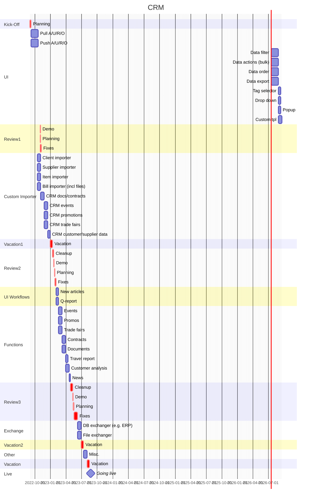

# Timeline

```mermaid
gantt
    title         CRM
    dateFormat  YYYY-MM-DD
    excludes     weekends
    section Kick-Off
        Planning                    :crit, a, 2022-09-01, 5d
    section UI
        Pull A/U/R/O                  :1a2, after a, 30d
        Push A/U/R/O                  :1a3, after a, 30d
        Data filter                 :1b1, after 1a1, 30d
        Data actions (bulk)            :1b2, after 1a1, 30d
        Data order                  :1b3, after 1a1, 30d
        Data export                  :1b4, after 1a1, 30d
        Tag selector                :1c1, after 1b4, 10d
        Drop down                    :1c2, after 1b4, 10d
        Popup                        :1c3, after 1b4, 10d
        Custom tpl                     :1d1, after 1b1, 15d
    section Review1
        Demo                        :crit, 0a1, 2022-11-01, 1d
        Planning                    :crit, 0a2, 2022-11-01, 3d
        Fixes                        :crit, 0a3, 2022-11-01, 5d
    section Custom Importer
        Client importer              :2a1, 2022-10-15, 15d
        Supplier importer            :2b1, 2022-10-15, 15d
        Item importer                :2c1, 2022-10-15, 15d
        Bill importer (incl files)  :2d1, 2022-10-15, 15d
        CRM docs/contracts            :2e1, after 2d1, 15d
        CRM events                    :2f1, after 2e1, 15d
        CRM promotions                :2f2, after 2e1, 15d
        CRM trade fairs                :2f3, after 2e1, 15d
        CRM customer/supplier data  :2g1, after 2f3, 10d
    section Vacation1
        Vacation                    :crit, v1, after 2g1, 10d
    section Review2
        Cleanup                        :crit, 0b1, after v1, 5d
        Demo                        :crit, 0b2, after 0b1, 1d
        Planning                    :crit, 0b3, after 0b2, 3d
        Fixes                        :crit, 0b4, after 0b3, 5d
    section UI Workflows
        New articles                :3a1, after 0b4, 10d
        Q-report                    :3b1, after 0b4, 10d
    section Functions
        Events                        :4a1, after 3b1, 15d
        Promos                        :4b1, after 3b1, 15d
        Trade fairs                    :4c1, after 3b1, 15d
        Contracts                    :4d1, after 4c1, 15d
        Documents                    :4e1, after 4c1, 15d
        Travel report                :4f1, after 4e1, 10d
        Customer analysis            :4g1, after 4e1, 15d
        News                        :4h1, after 4g1, 5d
    section Review3
        Cleanup                        :crit, 0c1, after 4h1, 10d
        Demo                        :crit, 0c2, after 0c1, 1d
        Planning                    :crit, 0c3, after 0c2, 3d
        Fixes                        :crit, 0c4, after 0c3, 15d
    section Exchange
        DB exchanger (e.g. ERP)        :5a1, after 0c4, 15d
        File exchanger                :5b1, after 0c4, 15d
    section Vacation2
        Vacation                    :crit, v2, after 5b1, 10d
    section Other
        Misc.                        :6a1, after v2, 15d
    section Vacation
        Vacation                    :crit, v3, after 6a1, 10d
    section Live
        Going live                    :milestone, 2023-08-31
```

